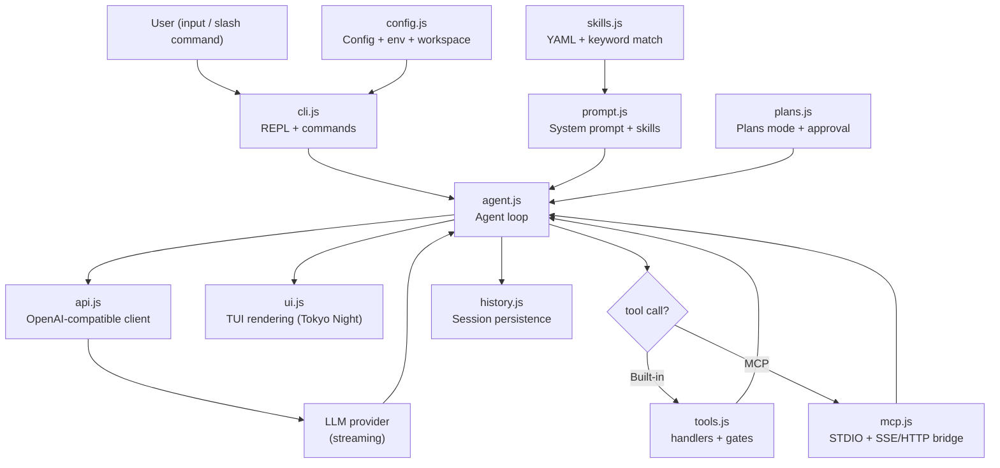
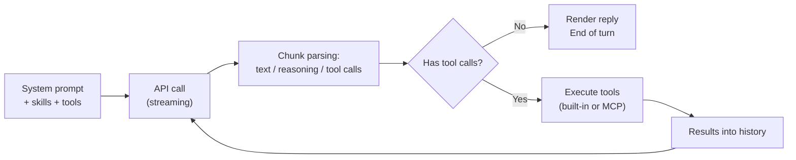

# Emile — Architecture

> **Status:** 🟢 Current · **Structural source of truth for emile-cli.**
> Stack: Node.js >= 18, pure ES modules (no build step), no TypeScript. Decisions recorded in ADRs (`docs/adr/`).

---

## 1. Overview

Emile is a terminal coding agent. The core is an **agent loop**: user input assembles a system prompt (base + skills + tools), calls the LLM API in streaming mode, parses text/reasoning/tool calls, executes tools and feeds results back into the history until the model stops requesting tools.

---

## 2. Modules (`src/`)

| Module | Responsibility | Golden rules |
|--------|------------------|----------------|
| `bin/emile.js` | Minimal entry point | Bootstrap only; no logic |
| `cli.js` | Flag parsing (commander), REPL lifecycle and command orchestration | Dynamic imports of heavy dependencies for fast startup; exact slash-command dispatch is delegated to `commands/` |
| `agent/` | **Agent domain** — `agent.js` (runAgent loop, tool dispatch, free-model fallback and checkpoint recovery), `reasoning.js` (provider reasoning normalization and structured-block preservation), `session-summary.js` (periodic bounded session titles), `session-stats.js` (sessionStats, full-payload cost/context math, initSessionStats), `compression.js` (context-aware history gate + hysteresis and safe truncation fallback), `index.js` (barrel) | Loop response/tool rendering delegates to `ui/`; provider reasoning formats are normalized at the stream boundary, cumulative snapshots are reduced to unseen suffixes and only one legacy/structured source is rendered; checkpoints reuse the existing tool gates; compression uses 80% of the same model window shown by context tracking and drops oldest complete history groups toward 70% if summarization fails |
| `api/` | **API domain** — `client.js` (OpenAI-compatible multi-provider client, provider-specific reasoning parameters including Anthropic budgets, retry policy and friendly failure classification), `provider-tools.js` (provider-owned optional tools), `index.js` (barrel) | New provider = new `baseURL` branch + env var in `config.js`; provider-owned schemas are composed only for their owning provider; reasoning request shapes remain provider-specific; raw provider errors are not rendered directly |
| `models.js` | Model metadata: dynamic OpenRouter catalog (context, pricing, reasoning capability) with a persisted cache and a static fallback table | Single source consulted by cost/quota/effort and `/model`; catalog initialization is best-effort and non-OpenRouter providers retain curated options |
| `tools/` | **Tools domain** — `security.js` (`resolveSafePath`, `normalizeWorkspaceCwd` + command whitelist), `definitions.js` (schemas), `file-state/` (`read-cache.js`, `undo-stack.js`, `persistence.js`, `path.js`, barrel), `show-diff.js`, `handlers/` (one file per tool), `index.js` (barrel) | Every write goes through `resolveSafePath`; every command goes through safe mode + dry-run and carries a validated session cwd; network-to-shell commands get an explicit warning; LLM output is untrusted input; `/undo N` restores only recorded safe paths; undo stack is persisted under `.emile/undo/<sessionId>/` and survives restarts |
| `ui/` | **UI domain** — `theme.js` (`C` palette, GAP, text utils, measures, box primitives), `sanitize.js`, `control.js` (terminal-control stripping), `title.js` (sanitized activity-driven OSC title), `markdown.js`, `turn-state.js`, `tool-lines.js`, `rules-panel.js`, `header.js`, `config-panel.js`, `status-bar.js`, `user-message.js`, `response.js`, `thinking.js`, `help.js`, `diff-block.js`, `history-replay.js`, `prompt-input.js`, `prompt-input-persistent.js`, `turn-keys.js`, `model-picker.js`, `switch-session.js`, `spinner.js`, `index.js` (barrel) | Single source of colors (`C`); dynamic terminal content is sanitized; thinking and prompt redraws assemble complete bounded frames; raw-mode surfaces own stdin exclusively. During a turn, `listenTurnKeys` temporarily arbitrates stdout so output advances above the shared full prompt and the real cursor remains at the draft; cleanup restores the prior writer and idle prompt ownership |
| `mcp.js` | MCP server lifecycle (STDIO/SSE/HTTP), first-connect consent, bounded reconnect and tool bridge | External tools are validated at the transport boundary, namespaced `mcp__<server>__<tool>`; UI resolves the final separator consistently with the explicit map; credentials are never shown in prompts or warnings |
| `skills.js` | YAML skill parsing, workspace detection, task-relevance matching and bounded compilation | Skills live in `.agent/skills/`; explicit lists bypass relevance filtering; auto mode retains `clean-code` |
| `plans.js` | Plans mode: draft, approval, status rendering | Writes only after explicit approval |
| `prompt.js` | System prompt assembly | Base + active skills + tools + `loadRules()` (cache-stable frozen prefix) |
| `rules.js` | Optional user-authored rules discovery (`.emilerules`→`AGENTS.md`→`.clinerules`→`.cursorrules`), mtime-cached, 12k cap | Read-only; external symlinks rejected; no generated defaults or execution |
| `lifecycle/` | Shutdown coordinator: ordered SIGINT/SIGTERM/SIGHUP/`beforeExit` handler with 5 phases (stop-input → drain-tools → flush-session → close-mcp → restore-terminal), global 3 s cap and `--verbose` phase timing | No tool execution or `process.exit` from within a phase; `shuttingDown` flag prevents re-entrancy |
| `recovery.js` | Boot-time session scan: classifies every `pending` checkpoint as `recoverable`, `abandoned` or `corrupt`; moves corrupt sessions to `.emile/sessions/<id>/corrupt/` | Read-only; never throws; `RecoveryReport` returned regardless of scan outcome; REPL shown after scan |
| `config.js` | Global config load/save, env vars, workspace resolution, session-scoped web-search/cwd state and per-provider `resolveApiKey()` | Precedence: `~/.emile/config.json` > provider-specific env var only (no cross-provider fallback); API key file written with `mode: 0600` |
| `commands.js` | Connection and model wizards; assembles provider options and delegates model search to `ui/model-picker.js` | Model ids/catalog metadata remain data; terminal interaction stays in `ui/` |
| `commands/` | Interactive slash-command registry and handlers | Exact command names only; handlers receive explicit REPL context and preserve existing security/UI gates |
| `history.js` | Session persistence per workspace (save/restore/list/delete), complete/tool-pending metadata, bounded persisted snapshots, session cwd and non-mutating projections | Sessions in `.emile/` (gitignored); `reasoning_content` is omitted, cwd is normalized inside the workspace, and oldest tool results may become `[truncated]` on disk while active memory remains unchanged |

### Runtime directories

| Directory | Role |
|-----------|-------|
| `.agent/` | Generic agent kit (agents/skills/workflows) — **not product documentation** (see the hierarchy in `.clinerules`) |
| `~/.emile/` | User-global provider configuration and credentials; `config.json` is written with mode `0600` |
| `.emile/` | Workspace-scoped sessions, undo state, web configuration and MCP consent (gitignored) |
| `mcp.json` | MCP server configuration, including `transport`, `url` and optional interpolated HTTP headers |

---

## 3. Agent Loop Flow

**Loop invariants:**

1. The system prompt is frozen per `(plansMode, relevantSkills)` session key and reused across turns (cache stability); auto-detected skills are filtered against the current task before the key is built, while explicit skill lists remain authoritative.
2. Streaming is parsed chunk by chunk: cumulative legacy/structured reasoning is normalized to unseen text, only one readable reasoning source is rendered, structured blocks are preserved, text accumulates, and tool calls are assembled incrementally.
3. Tool execution respects safe mode, dry-run and the whitelist; tool failures go back to the model as error results (not crashes).
4. Context/cost stats update on every response with real usage (`usage`), with a character-based estimate (`~`-prefixed) before the first response.
5. In Plans mode, explicit approval is requested before the first model stream. Before a turn's initial API call, the complete payload estimate (system prompt, tool schemas and all message roles) is compared with 80% of `getContextLimit(model)`; successful compression requires more than 40% subsequent history growth before it can repeat, and failed summarization falls back to oldest-group truncation toward 70%.
6. The session is checkpointed before and after tool execution, then saved as `complete` after every successful turn; pending checkpoints are recovered through the existing tool handlers when a session is loaded. Undo restores recorded file states newest-first and requires confirmation for multiple entries.
7. The terminal title observes lifecycle/loop state through `ui/title.js`; activity descriptions are deterministic and never expose prompts, command arguments or search queries.
8. MCP connections require first-use approval, persist only the approved server name under `.emile/mcp-consent.json`, and retry unexpected disconnects at 500ms/1s/2s before degrading with a warning; shutdown cancels retries.
9. Provider-owned tools are composed at the API boundary: OpenRouter web search is included only when the provider is OpenRouter and the user explicitly enables it. `runCommand` executes from the session cwd, probes the resulting cwd in the same shell and persists only workspace-contained directories; `/new` resets it and resumed sessions restore it.

---

## 4. Recorded decisions (ADRs)

| ADR | Decision |
|-----|---------|
| [ADR-0001](adr/0001-tech-stack-choice.md) | Stack: Node.js + pure ES modules, no build step, `openai` SDK as client, commander + @clack/prompts |
| [ADR-0002](adr/0002-quality-gates.md) | Native `node:test`, ESLint and CI quality gates |
| [ADR-0003](adr/0003-active-prompt-output-arbitration.md) | Temporary stdout arbitration keeps the full active prompt and real caret stable during streamed output |

> Every new architectural decision requires an ADR (Rule 2 of `.clinerules`).

---

## 5. Evolution Principles

1. **No build step by default** — any change in that direction requires an ADR.
2. **Fast startup is a requirement** — dynamic imports and lazy loading are the standard for code not critical to first render.
3. **Isolated UI layer** — visual changes start in `docs/visual-identity.md`, not in the code.
4. **Security gates never regress** — no feature may weaken safe mode, dry-run, the whitelist or `resolveSafePath`.
5. **Provider-agnostic** — no loop business logic may couple to a specific provider; peculiarities stay in `api.js`/`config.js`.
