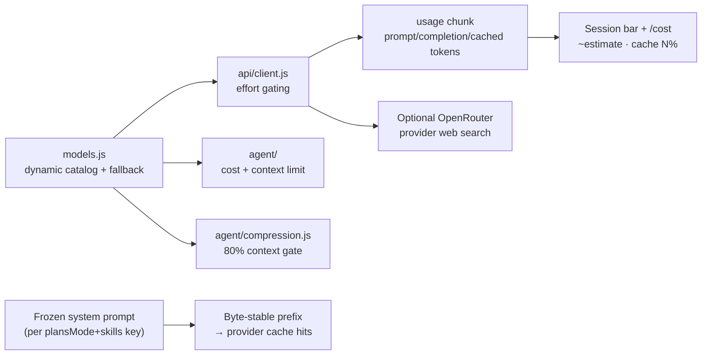

# Feature: Model System (metadata, effort, context tracking, cache)

| Field | Value |
|-------|-------|
| **Status** | `active` |
| **Delivery date** | 2026-08-25 |
| **Source spec** | `specs/2026-08-25-model-system` + `specs/2026-08-25-dynamic-model-catalog` + `specs/2026-08-25-context-aware-compression` + `specs/2026-08-30-plans-compression-resilience` + `specs/2026-08-30-dynamic-model-catalog-ui` + `specs/2026-08-30-anthropic-thinking-budget` + `specs/2026-08-30-model-search-picker` + `specs/2026-08-30-model-context-display` + `specs/2026-08-30-readable-token-units` + `specs/2026-08-30-streaming-input-integrity` + `specs/2026-08-31-web-search-tool-reliability` |
| **PRD RFs served** | RF-06, RF-08, RF-09, RF-13, RF-19, RF-20 |
| **Owner/Area** | Agent Loop / API / UI (`src/models.js`, `src/api/`, `src/agent/`, `src/ui/model-picker.js`) |

---

## Description

The model knowledge and session-telemetry system: a dynamic catalog with static fallbacks answers context windows, pricing and reasoning capability; reasoning effort is normalized and capability-gated before reaching the API; context tracking distinguishes the pre-call estimate from measured API usage; and history compression scales to 80% of that same model window instead of treating every paid/free route alike. The conversation prefix remains byte-stable per session to maximize provider prompt-cache hits, with the hit rate visible in the status bar and `/cost`. `/model` provides incremental, case-insensitive search with at most seven visible results; OpenRouter uses its live/cache catalog and providers without a supported catalog endpoint use curated options. Streamed reasoning is normalized to prevent cumulative snapshots and structured/legacy dual emission from duplicating the visible thought. OpenRouter web search is an explicit, cost-visible option composed only for that provider.

## How It Works

## Technical Details

| Item | Detail |
|------|---------|
| **Model metadata** | `src/models.js` → dynamic OpenRouter catalog + `MODEL_INFO` fallback through `getModelInfo()`; safe default 128k / $3/$15; `/model` waits for and searches live/cache OpenRouter entries |
| **Model picker** | `src/ui/model-picker.js` → sanitized incremental substring filter, maximum seven visible rows, keyboard navigation and cancellation; non-OpenRouter providers search their curated lists |
| **Token display** | `src/ui/theme.js` → shared compact formatter uses `M` for counts at or above one million and `k` below that boundary; used by the input footer and status bar |
| **Effort gating** | OpenRouter uses `reasoning.effort`; Requesty Anthropic-family models use `thinking.budget_tokens` (512–16,384); generic models use `reasoning_effort`; unsupported fields are omitted |
| **Context honesty** | Pre-call estimate (`chars / 4`) prefixed with `~`; measured usage unprefixed; limit from MODEL_INFO |
| **Context compression** | Full payload compresses at 80% of the active catalog window; secondary system summaries are counted, same-session retry requires >40% post-compression history growth, and failed summarization drops oldest complete groups toward 70% |
| **Cache stability** | System prompt frozen per `(plansMode, skills)` key — workspace snapshot does not change mid-session |
| **Cache telemetry** | `cached_tokens` accumulated from usage (defensive field fallbacks); `cache: N%` segment in the status bar/footer; hit rate in `/cost` |
| **Reasoning stream integrity** | `src/agent/reasoning.js` reduces cumulative/overlapping snapshots to unseen suffixes; `src/agent/agent.js` renders one readable reasoning channel while preserving structured details |
| **Provider web search** | `src/api/provider-tools.js` adds the bounded OpenRouter server tool only when `webSearch` is explicitly enabled; `/websearch` and `--web-search` expose the opt-in |

## Where It Lives in the Code

| Layer | Main paths |
|--------|---------------------|
| Metadata table | `src/models.js` |
| API call + retry | `src/api/client.js` (`reasoning_effort` gate, `getRetryDelayMs`) |
| Agent loop + context policy | `src/agent/agent.js`, `src/agent/session-stats.js`, `src/agent/compression.js` |
| Rendering | `src/ui/status-bar.js`, `src/ui/prompt-input.js`, `src/cli.js` (`/cost`) |
| Stream/input reliability | `src/agent/reasoning.js`, `src/agent/agent.js`, `src/ui/thinking.js`, `src/ui/prompt-input.js` |
| Provider-owned tools | `src/api/provider-tools.js`, `src/api/client.js`, `src/commands/handlers.js` |

## Known Limitations

- Offline catalog cache and static fallback metadata are best-effort and can go stale; startup refreshes the live catalog when available.
- The workspace snapshot in the system prompt is frozen until plans mode or skills change (deliberate cache trade-off).
- Providers that don't report cached tokens show no cache percentage.
- Only OpenRouter has a validated remote catalog integration; other providers' searchable options can become stale until their catalog contracts are added.
- Web search is currently validated only for OpenRouter, is disabled by default and may add provider charges, including when the selected route is free.
- Context estimation uses the existing four-characters-per-token approximation; no provider-specific tokenizer or mid-tool-loop compression is implemented.
- If both summarization and safe truncation cannot reduce the history, the request continues with the existing warning and remains subject to the provider's context error handling.

## Change History

| Date | Change | Reference |
|------|---------|------------|
| 2026-08-25 | Created: MODEL_INFO table, gated effort, honest context tracking, cache-stable prefix, cache telemetry; IMPROVEMENTS § 1.2/1.3/3.2/3.4 resolved | `specs/2026-08-25-model-system` / CHANGELOG |
| 2026-08-25 | Dynamic model catalog: metadata resolved live from the OpenRouter public endpoint by model id (persisted cache + static fallback), fixing reasoning mislabels (GLM 5.x, stealth models) and staleness | `specs/2026-08-25-dynamic-model-catalog` / CHANGELOG |
| 2026-08-25 | Context-aware compression: 80% of the active model window, full-payload estimate, secondary-system-message accounting and >40% growth hysteresis | `specs/2026-08-25-context-aware-compression` / CHANGELOG |
| 2026-08-30 | Plans preflight approval and 70% oldest-group truncation fallback when context summarization fails | `specs/2026-08-30-plans-compression-resilience` / CHANGELOG |
| 2026-08-30 | `/model` uses the live OpenRouter catalog with context/pricing labels and safe curated fallback for other providers | `specs/2026-08-30-dynamic-model-catalog-ui` / CHANGELOG |
| 2026-08-30 | Added native Anthropic thinking budget mapping for Requesty Anthropic-family models | `specs/2026-08-30-anthropic-thinking-budget` / CHANGELOG |
| 2026-08-30 | Replaced the unbounded `/model` select with incremental id/label search, seven visible results, keyboard navigation and safe manual-entry fallback | `specs/2026-08-30-model-search-picker` / CHANGELOG |
| 2026-08-30 | Model picker context metadata uses `M` for million-token windows and keeps `k` for smaller windows | `specs/2026-08-30-model-context-display` / CHANGELOG |
| 2026-08-30 | Input footer and status bar use compact `M` units for million-token counts | `specs/2026-08-30-readable-token-units` / CHANGELOG |
| 2026-08-31 | Cumulative reasoning snapshots and repeated structured details are rendered once; prompt/thinking redraws are atomic and `Shift+Enter` inserts multiline input | `specs/2026-08-30-streaming-input-integrity` / CHANGELOG |
| 2026-08-31 | Added explicit OpenRouter provider web search with bounded parameters and visible charge warning | `specs/2026-08-31-web-search-tool-reliability` / CHANGELOG |
