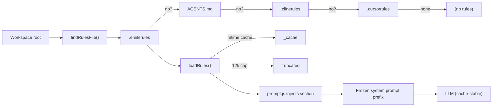

# Feature: Project Rules System (`.emilerules`)

| Field | Value |
|-------|-------|
| **Status** | `active` |
| **Delivery date** | 2026-08-25 |
| **Source spec** | `specs/2026-08-25-rules-system` |
| **PRD RFs served** | RF-17 |
| **Owner/Area** | Agent Loop / Prompt (`src/rules.js`, `src/prompt.js`, `src/cli.js`) |

---

## Description

Emile honors optional, user-authored per-project rules — the always-on preferences a project
owner wants enforced on every session, higher in authority than skills (which are keyword-triggered).
The discovery chain is `.emilerules` → `AGENTS.md` → `.clinerules` → `.cursorrules`,
so existing projects that already carry a Cline/Codex/Cursor rules file are picked up
automatically. The active file is injected verbatim into the system prompt as a
`=== PROJECT RULES ===` section, cached by mtime, and capped at 12k characters to avoid
bloating every request. Emile never creates or ships preference content on the user's behalf.

---

## How It Works

---

## Technical Details

| Item | Detail |
|------|--------|
| **Discovery** | `RULES_PRIORITY` array; first file that resolves to a regular file inside the workspace wins |
| **Cache** | Byfile path + mtime (`_cache` module-level singleton); avoids re-reading on repeated `buildSystemPrompt` calls within a session |
| **Size cap** | `MAX_RULES_CHARS = 12_000`; truncation appends a `[— rules truncated for context —]` notice |
| **Injection point** | In `prompt.js`, after `=== ENVIRONMENT CONTEXT ===`, before `compileWorkspaceContext()` — frozen per session (cache-stable) |
| **CLI command** | `/rules` — prints active filename, path, truncation state and terminal-sanitized content; explains how to create a user-owned `.emilerules` if none is found |
| **Trust model** | Local user-controlled config (same as `.clinerules`); injected verbatim, never executed, no path/command resolution |
| **Ownership** | Read-only and opt-in; the CLI never creates or edits `.emilerules` |

---

## Where It Lives in the Code

| Layer | Main paths |
|--------|-----|
| Rules module | `src/rules.js` — `findRulesFile()`, `loadRules()`, `formatRulesBlock()` |
| Prompt assembly | `src/prompt.js` — `buildSystemPrompt()` calls `loadRules()` and injects the block |
| CLI command | `src/cli.js` — `/rules` dispatches to `runRulesCommand()` in `src/commands.js` |
| Safe terminal rendering | `src/ui/control.js`, `src/ui/rules-panel.js` |

---

## Known Limitations

- No hot-reload: editing `.emilerules` mid-session requires a new session (same as plans/skills).
- No per-rule opt-out: it's all-or-nothing (a project either has rules or doesn't).
- Rules are injected, not validated — markdown is passed through as-is.
- Rule content is sent to the configured model on each session; users must not store secrets in it.

## Change History

| Date | Change | Reference |
|------|---------|------------|
| 2026-08-25 | Created: user-owned discovery, mtime cache, 12k cap, workspace realpath confinement, prompt integration and terminal-sanitized `/rules` inspection | `specs/2026-08-25-rules-system` / CHANGELOG |
