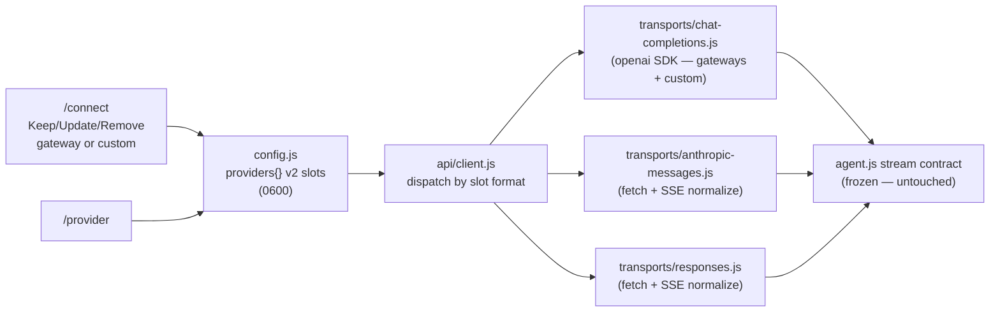

# Feature: Provider System — multi-slot credentials, `/provider` and custom endpoints

| Field | Value |
|-------|-------|
| **Status** | `active` |
| **Delivery date** | 2026-10-09 |
| **Source spec** | `specs/2026-10-09-provider-system` |
| **PRD RFs served** | RF-02 (multiple providers with a setup wizard — now per-provider slots + custom endpoints), RF-08 (reasoning effort control and model selection — per-endpoint effort dialect + custom-slot `/model`), RF-15 (automated contract tests) |
| **Owner/Area** | Configuration & Transport |

---

## Description

emile-cli now stores one credential slot **per provider** in `~/.emile/config.json` (version-2 document, still written with mode `0600`). Connecting is a one-time ritual: after `/connect` configures a gateway or a custom endpoint, `/provider` switches between configured providers in two keystrokes — the right key is picked from the slot, each provider remembers its own last-used model, and nothing is ever retyped. Re-running `/connect` on an already-configured provider offers **Keep / Update / Remove** instead of demanding the key again.

Custom endpoints are first-class: any URL the user registers (LM Studio, Ollama's shim, a corporate LiteLLM proxy, a raw Anthropic key, a Responses-only endpoint) works, speaking one of three wire formats — **Anthropic Messages** (`/v1/messages`), **OpenAI Chat Completions** (`/chat/completions`) or **OpenAI Responses** (`/responses`). Their streamed answers are normalized back into the same chunk shape the agent loop already consumes, so tool calls, reasoning streams and token accounting behave identically everywhere. For custom Chat Completions endpoints the slot can also name the body key the server uses for the reasoning effort (`reasoning_effort`, `reasoning`, `thinking`, `enable_thinking`, `chat_template_kwargs`, `effort`, `reasoningEffort` or `both`), because the ecosystem has no single convention.

## How It Works

- A legacy v1 flat file (`provider`/`apiKey`/`model`) migrates on load into `providers[<id>]` and the flat fields disappear on the next save.
- `resolveApiKey(id)` reads only the slot's own key, then the provider env var, then `''` — one provider's key is never used for another.
- A custom slot with a valid loopback `http://localhost` / `http://127.0.0.1` URL may have no key at all (local servers boot fine).

## Technical Details

| Item | Detail |
|------|---------|
| **CLI flags** | `-m, --model`, `-e, --effort` (unchanged); `EMILE_PROVIDER` env selects the initial gateway |
| **Slash commands** | `/connect` (credential manager + custom-endpoint wizard), `/provider` (slot switcher), `/model` (catalog or manual entry for custom) |
| **Tools** | none — configuration/transport layer only |
| **Configuration** | `~/.emile/config.json` v2: `version`, `activeProvider`, `providers{id: {apiKey, lastModel[, baseURL, format, label, reasoningStyle]}}`, `effort`, `webSearch`, `maxLoopIterations` |
| **Applicable security gates** | keys stored only in the `0600` config; listings show at most the last 4 characters; `formatApiError` redacts bearer/`sk-`/`key=` shapes; fetch transports use `redirect: 'manual'` and any `3xx` is fatal (**credentials never follow a redirect**); `http://` allowed only for `localhost`/`127.0.0.1`, enforced at write time **and** re-checked before any socket at client-build time (fail closed); `Responses` requests send `store: false` (no transcript upload); no new dependencies |

## Where It Lives in the Code

| Layer | Main paths |
|--------|---------------------|
| Storage & views | `src/config.js` (v2 load/migrate, `resolveApiKey`, `getProviderSlots`, `setActiveProvider`, `removeProvider`, `isValidProviderURL`, `REASONING_STYLES`) |
| Wizards & commands | `src/commands.js` (`/connect`, custom wizard), `src/commands/handlers.js` + `index.js` + `registry.js` (`/provider`) |
| Transports | `src/api/client.js` (format dispatch, `buildReasoningParams` + styles), `src/api/transports/` (`base.js`, `chat-completions.js`, `anthropic-messages.js`, `responses.js`) |
| Tests | `test/provider-config.test.js` (a–e contract tests), `test/api-transports.test.js` (23 contract/security tests) |

## Known Limitations

- **Anthropic `thinking` signatures do not round-trip** on the `anthropic-messages` format: internal history stores reasoning as plain text, so requests that already contain tool results send thinking **disabled** — only the first API call of a turn streams thinking.
- `pause_turn` (Anthropic) is surfaced as a visible notice; continuation is not implemented.
- Custom endpoints have no catalog: cost/context fall back to `models.js` `DEFAULT_MODEL_INFO`; one `lastModel` per slot (no multi-model list); native web search stays OpenRouter-only.

## Change History

| Date | Change | Reference |
|------|---------|------------|
| 2026-10-09 | Feature created (Stage A: slots + `/provider` + custom endpoints; Stage B: three transports + `reasoningStyle`) | `specs/2026-10-09-provider-system`; CHANGELOG `[Unreleased]` |
