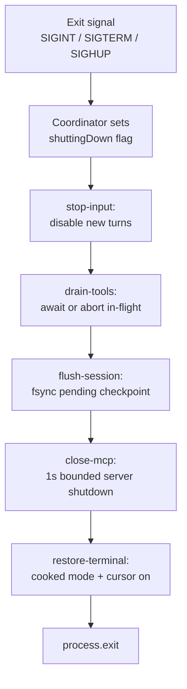
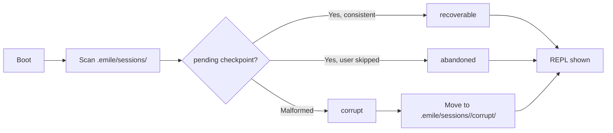

# Feature: Session Lifecycle Hardening

| Field | Value |
|-------|-------|
| **Status** | `active` |
| **Delivery date** | 2026-09-02 |
| **Source spec** | `specs/2026-09-02-session-lifecycle` |
| **PRD RFs served** | RF-05 (safe mode), RF-06 (undo), RF-07 (session persistence) |
| **Owner/Area** | Agent Loop / Session persistence / Tools / Config |

---

## Description

Emile now guarantees that the session survives any exit path (Ctrl+C, SIGTERM, terminal close, unhandled rejection) without corruption. On boot, every persisted session is scanned for `pending` checkpoints and classified before the REPL is shown. The undo stack persists across restarts, and API keys are resolved strictly per provider.

## How It Works

## Technical Details

| Item | Detail |
|------|---------|
| **CLI flags** | `--verbose` (phase timing) |
| **Slash commands** | `/undo`, `/undo N`, `/delete`, `/sessions` |
| **Tools** | Existing built-in tools; no new tool surface |
| **Configuration** | `.emile/undo/<sessionId>/` (gitignored); `.emile/config.json` mode `0600`; session cwd persisted per session |
| **Applicable security gates** | `resolveSafePath` (undo files confined to `.emile/undo/`); existing safe mode, dry-run, whitelist unchanged; `resolveApiKey` enforces provider-specific env vars only |

## Where It Lives in the Code

| Layer | Main paths |
|--------|---------------------|
| Shutdown coordinator | `src/lifecycle/` (5 phase modules + barrel) |
| Boot recovery | `src/recovery.js` (`runStartupRecovery` → `RecoveryReport`) |
| Undo persistence | `src/tools/file-state/undo-stack.js`, `src/tools/file-state/persistence.js`, `src/tools/file-state/path.js` |
| API key isolation | `src/config.js` (`resolveApiKey`, `saveUserConfig`) |
| Wiring | `src/cli.js`, `src/agent/agent.js`, `src/history.js` |

## Known Limitations

- Manual verifications for Ctrl+C mid-tool, SIGTERM idle, pending-checkpoint boot and Node 16 `EBADENGINE` warning are pending (T2.9–T2.12 in tasks.md); unit tests cover the logic but not the live terminal paths.
- 3 test-isolation failures remain in the automated suite (ESM module cache between test files) — not production bugs (T2.13 in tasks.md).
- Persisted undo is capped at 50 entries and 2 MB per entry; entries that exceed the size cap are recorded as `oversized: true`.
- Symlinks inside `.emile/undo/` pointing outside are refused by `persistence.js` via `realpath` check.
- `chmod 0600` is a no-op on Windows; the write still succeeds with a `--verbose` warning.
- A `pending` checkpoint left by a process crash between tool completion and checkpoint write is not recoverable by this module; it relies on the existing `specs/2026-08-30-session-resilience` resume path.

## Change History

| Date | Change | Reference |
|------|--------|------------|
| 2026-09-02 | Ordered 5-phase shutdown coordinator with 3 s global cap and `--verbose` timing | `specs/2026-09-02-session-lifecycle` / CHANGELOG |
| 2026-09-02 | Boot recovery scan classifying sessions as recoverable / abandoned / corrupt | `specs/2026-09-02-session-lifecycle` / CHANGELOG |
| 2026-09-02 | Undo stack persisted under `.emile/undo/<sessionId>/` and rehydrated on boot; cap at 50 enforced | `specs/2026-09-02-session-lifecycle` / CHANGELOG |
| 2026-09-02 | Per-provider `resolveApiKey` (no cross-provider fallback); config file mode `0600` | `specs/2026-09-02-session-lifecycle` / CHANGELOG |
| 2026-09-02 | `package.json` engines field `node >=18` | `specs/2026-09-02-session-lifecycle` / CHANGELOG |
