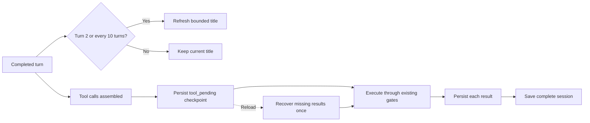

# Feature: Session Resilience

| Field | Value |
|-------|-------|
| **Status** | `active` |
| **Delivery date** | 2026-08-30 |
| **Source spec** | `specs/2026-08-30-session-resilience` + `specs/2026-08-30-session-reasoning-retention` + `specs/2026-08-30-session-size-management` |
| **PRD RFs served** | RF-07, RF-13 |
| **Owner/Area** | Agent Loop / Session persistence |

## Description

Emile keeps session titles useful beyond the first prompt and protects work when a turn is interrupted during tool execution. Summaries are refreshed periodically using a short, low-effort completion, while failures leave the existing title untouched.

Before a tool batch starts, the session records the assistant's pending calls. If the process stops, loading the session detects the checkpoint and resumes only calls without a matching persisted result through the normal tool security path.

## How It Works

## Technical Details

| Item | Detail |
|------|---------|
| **CLI flags** | `-H, --history` |
| **Slash commands** | `/switch`, `/sessions`, `/sessions clean <days>`, `/export [--export-thinking]` |
| **Tools** | Existing built-in and MCP tools; no new tool surface |
| **Configuration** | Session records in `.emile/history/*.json`; `--max-session-size`/`EMILE_MAX_SESSION_SIZE`; `--export-thinking` is opt-in |
| **Applicable security gates** | Existing tool handlers, safe mode, dry-run, command whitelist and `resolveSafePath` |

## Where It Lives in the Code

| Layer | Main paths |
|------|------------|
| Session records | `src/history.js` |
| Agent recovery | `src/agent/agent.js`, `src/agent/session-summary.js` |
| Lifecycle wiring | `src/cli.js`, `src/commands/handlers.js` |

## Known Limitations

- A process failure in the small interval after a tool returns and before its checkpoint is written may require the tool to be retried on reload.
- Summaries are best-effort and may remain the previous title when the provider is unavailable.
- Legacy session files load as complete and cannot recover a turn that was never checkpointed.
- New session snapshots omit `reasoning_content`; active in-memory history still retains it for the current turn.
- Old tool results may be replaced by `[truncated]` in persisted snapshots only; `/sessions clean <days>` removes old records but does not affect the active session.

## Change History

| Date | Change | Reference |
|------|--------|-----------|
| 2026-08-30 | Added periodic titles and pending-tool checkpoints with safe reload recovery | `specs/2026-08-30-session-resilience` / CHANGELOG |
| 2026-08-30 | Omitted reasoning from persisted snapshots and made export reasoning opt-in | `specs/2026-08-30-session-reasoning-retention` / CHANGELOG |
| 2026-08-30 | Bounded persisted tool output and added age-based session cleanup | `specs/2026-08-30-session-size-management` / CHANGELOG |
