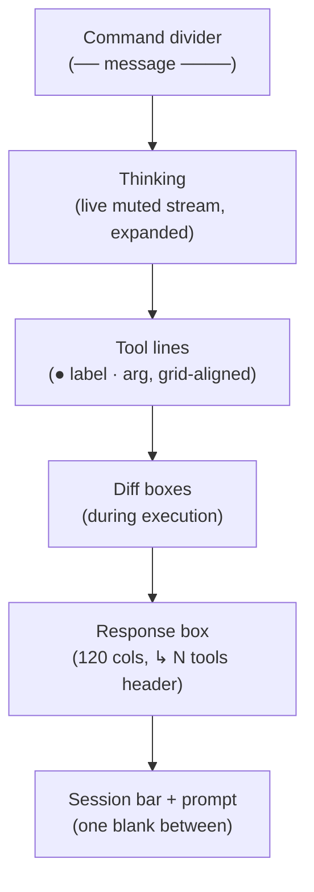

# Feature: Terminal UI (TUI)

| Field | Value |
|-------|-------|
| **Status** | `active` |
| **Delivery date** | 2026-08-25 |
| **Source spec** | `specs/2026-08-25-tui-overhaul` (Pass 1) + `specs/2026-08-25-tui-premium` (Pass 2) + `specs/2026-08-25-tui-open-boxes` (Pass 3) + `specs/2026-08-25-prompt-multiline-fix` (Pass 4) + `specs/2026-08-25-dynamic-terminal-title` + `specs/2026-08-30-reasoning-details-display` + `specs/2026-09-01-turn-interrupt-queue` |
| **PRD RFs served** | RF-14, RF-16, RF-18 |
| **Owner/Area** | UI (`src/ui/`) |

---

## Description

The terminal user interface of emile: the Tokyo Night palette, boxed content, live thinking stream, input prompt and activity-driven terminal-tab title. The conversation has a consistent visual rhythm, while the title reports startup, waiting, thinking, responding, context compression and allowlisted tool activities even when the tab is not focused.

## How It Works

A full turn renders as a sequence of blocks, each owning one leading gap and never printing trailing blanks, which guarantees exactly one blank line between adjacent blocks:

## Technical Details

| Item | Detail |
|------|---------|
| **CLI flags** | Visual behavior only — no flags |
| **Slash commands** | `/thinking` (expand/collapse reasoning — expanded by default, opt-out collapse) |
| **Configuration** | `config.expandThinking` (`true` = expanded for both live and completed reasoning; default expanded) |
| **Reasoning request** | OpenRouter receives `reasoning: { effort }`; visible text supports `reasoning_details` while encrypted blocks remain hidden |
| **Semantic tool colors** | read=info · write/edit=warn · exec=red · grep/find=gold · list=fg · plan tools=accent |
| **Palette tokens** | `C.gold` (#FFD700), `C.ghost` (#3B4261); `GAP` spacing constants |
| **Terminal title** | OSC 0, activity-first, max 100 chars; real TTY only; duplicate writes suppressed |
| **Prompt lifecycle** | `persistentPromptInput` owns idle stdin; Tab completes slash commands and nested pickers receive exclusive ownership. During active turns, `listenTurnKeys` renders the same full frame, routes stdout above it and leaves the real caret at the draft before returning ownership afterward |
| **Applicable security gates** | Assistant output sanitization; terminal title excludes prompts/command/query args and strips ANSI/OSC/control bytes |

## Where It Lives in the Code

| Layer | Main paths |
|--------|---------------------|
| Rendering | `src/ui/` module tree (`theme.js`, components and `index.js` barrel) |
| Prompt interaction | `src/ui/prompt-input-persistent.js`, `src/ui/turn-keys.js`, `src/ui/switch-session.js`; lifecycle orchestration in `src/cli.js` |
| Terminal title | `src/ui/title.js`; lifecycle integration in `src/cli.js`, `src/agent/agent.js` and `src/agent/compression.js` |
| Spinner | `src/ui/spinner.js` (silent stop on success) |
| Render harness | `test-ui.js` (full simulated turn) |

## Known Limitations

- Chained-tool waiting states still use the generic spinner (no per-step progress).
- No dedicated visual treatment for API errors/model fallback yet.
- Slash commands don't open a visual "chapter" divider; interactive selects lack radio-style active/inactive treatment.
- `/cost` still renders as a loose list outside the box pattern.
- See `docs/visual-identity.md` § 5 (visual debt backlog) and the deferred items in the spec § 5.
- Terminals that ignore OSC titles receive no alternate window-manager integration; the previous shell title cannot be queried/restored portably.

## Change History

| Date | Change | Reference |
|------|---------|------------|
| 2026-08-25 | Pass 1: vertical rhythm, tools box with semantic colors, dimmed thinking, silent spinner, box padding, dim `off` states, prompt gap, `pc`→`C` consolidation | `specs/2026-08-25-tui-overhaul` / CHANGELOG |
| 2026-08-25 | Pass 2 (premium): grid-aligned tool lines replacing the tools box, ghost thinking collapsed by default, command divider for user messages, `↳ N tools` header replacing the tools-done footer, 88-column response box, gold/ghost tokens, GAP constants | `specs/2026-08-25-tui-premium` / CHANGELOG |
| 2026-08-25 | Pass 3 (open boxes): side borders removed from every box (top/bottom only), white top-border bug fixed via separately-composed ANSI parts, 4-space content indent, open-style diff block | `specs/2026-08-25-tui-open-boxes` / CHANGELOG |
| 2026-08-25 | Pass 4: prompt multiline rendering fixed (explicit per-row writes, clamped cursor column, divider echo on submit), response box measure raised to `MAX_BOX_W = 120` | `specs/2026-08-25-prompt-multiline-fix` / CHANGELOG |
| 2026-08-25 | Dynamic terminal title: automatic sanitized lifecycle, reasoning, response, compression and tool states; no model-facing tool or prompt/argument leakage | `specs/2026-08-25-dynamic-terminal-title` / CHANGELOG |
| 2026-08-30 | Reasoning display fix: unified `/thinking` state, completed duration for expanded streams, and OpenRouter `reasoning_details` parsing with encrypted-block protection | `specs/2026-08-30-reasoning-details-display` / CHANGELOG |
| 2026-08-30 | Reasoning is expanded by default after validation with `minimax-m3:free`; `/thinking` and Ctrl+P remain the collapse toggle | `specs/2026-08-30-reasoning-details-display` / CHANGELOG |
| 2026-09-01 | Persistent prompt lifecycle: Tab completion, exclusive nested-picker stdin and reliable prompt resume after `/switch` | `specs/2026-09-01-turn-interrupt-queue` / CHANGELOG |
| 2026-09-02 | Active-turn visual parity: shared full prompt, distinct `●` autocomplete selection, prompt-aware stdout arbitration and real caret preserved at the draft | `specs/2026-09-01-turn-interrupt-queue` / ADR-0003 |
