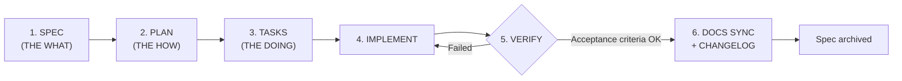

# Specs — Spec-Driven Development (SDD)

This directory holds the **specifications** that govern all emile-cli development. Under SDD, no implementation starts without a spec: first we specify **what** and **why**, then we plan **how**, only then we implement.

> The SDD execution rules are mandatory and are defined in [`.clinerules`](../.clinerules) (Rule 3), loaded automatically by Cline in every session.

---

## The emile-cli SDD Cycle



| Phase | Artifact | Responsible for | Key question |
|------|----------|-----------------|--------------|
| **1. SPEC** | `spec.md` | Define problem, functional requirements and acceptance criteria | "What are we building and why?" |
| **2. PLAN** | `plan.md` | Define technical approach, impacted files, decisions (ADRs) | "How will we build it?" |
| **3. TASKS** | `tasks.md` | Break the plan into granular, ordered, testable tasks | "What concrete steps do we take?" |
| **4. IMPLEMENT** | code | Execute the tasks marking `- [x]` in `tasks.md` | "Are we following the plan?" |
| **5. VERIFY** | verification | Validate against the spec's acceptance criteria | "Does it work as specified?" |
| **6. DOCS SYNC** | docs/ + features/ | Update all affected documentation + CHANGELOG + feature registry entry in `features/` | "Does the documentation reflect reality?" |

---

## Folder Structure

```
specs/
├── README.md                  # this file
├── _templates/                # mandatory templates (copy, don't edit)
│   ├── spec.md
│   ├── plan.md
│   └── tasks.md
└── YYYY-MM-DD-spec-name/      # one directory per spec
    ├── spec.md
    ├── plan.md
    └── tasks.md
```

---

## Spec Lifecycle

| Status | Where it lives | Meaning |
|--------|-----------|-------------|
| `draft` | `specs/YYYY-MM-DD-name/` | Being written, subject to change |
| `approved` | `specs/YYYY-MM-DD-name/` | Specified and ready for implementation |
| `implemented` | `specs/YYYY-MM-DD-name/` | Code delivered and verified against the acceptance criteria |
| `archived` | `specs/archive/` | Moved to the historical archive (never deleted) |

The status is recorded in the `Status:` field of each `spec.md` header.

---

## Process Rules

1. **Names:** directories in `YYYY-MM-DD-kebab-case` format, created from the spec's opening date.
2. **Mandatory templates:** every new spec is born from a copy of `specs/_templates/`. Don't alter the original templates.
3. **Traceability:** every implementation commit must reference the spec in its message body (e.g., `Refs: specs/2026-08-25-tui-overhaul`).
4. **Scope change during implementation:** update the `spec.md` first (with justification), then the code. Never the other way around.
5. **Specs are history:** never delete a spec — archive it under `specs/archive/` at the end.
6. **One spec per concern:** prefer several small, focused specs over a monolithic one.
7. **Quality and security from the spec:** classify the risk and document threat surfaces (command execution, file writes, paths, LLM inputs), negative criteria and verification per [Code Quality and Security](../docs/code-quality-and-security.md).
8. **Evidence, not checkbox:** `tasks.md` records commands, results, limitations and smoke tests; a check without evidence doesn't close an acceptance criterion.
9. **Git discipline:** implementation happens on the spec's feature branch (e.g., `feat/tui-overhaul`), committing only the files belonging to that spec (Rule 8 of `.clinerules`).
